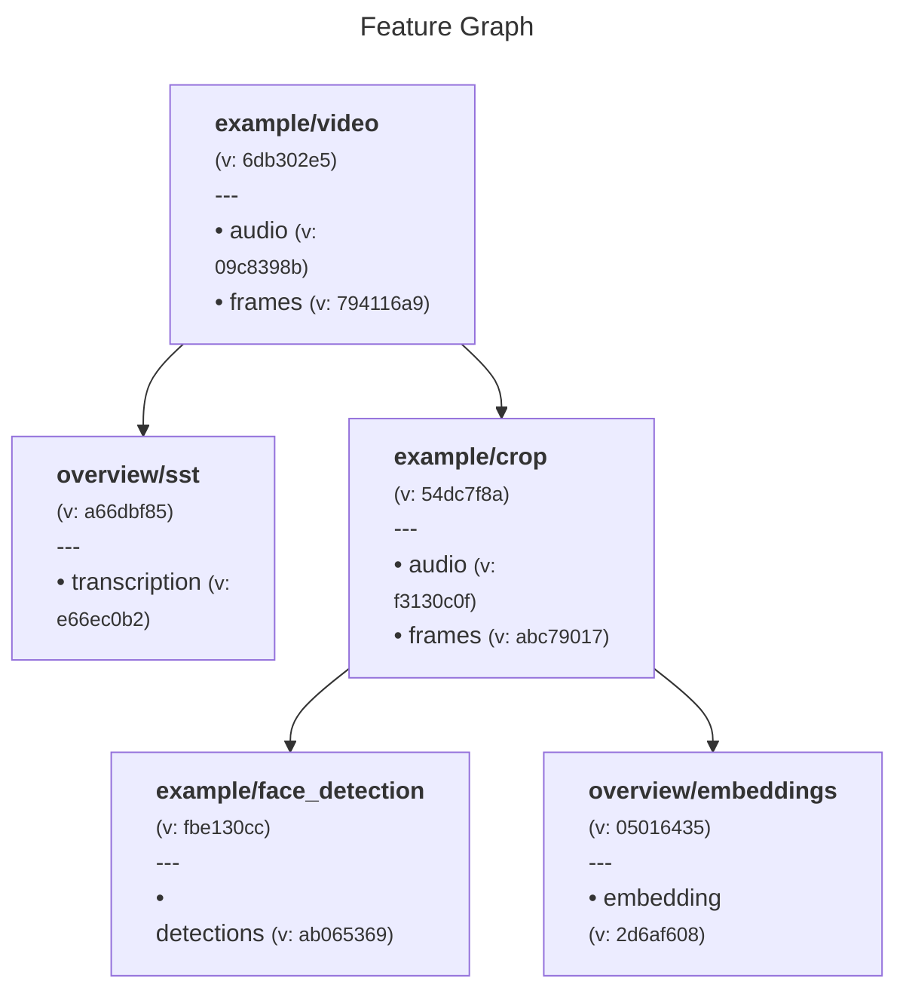

# Metaxy

## Overview

**Metaxy** is a declarative metadata management system for multi-modal data and machine learning pipelines. Metaxy allows statically defining graphs of features with versioned **fields** -- logical components like `audio`, `frames` for `.mp4` files and **columns** for feature metadata stored in Metaxy's metadata store. With this in place, Metaxy provides:

- **Sample-level data versioning**: Track field and column lineage, compute versions as hashes of upstream versions for each sample
- **Incremental computation**: Automatically detect which samples need recomputation when upstream fields change
- **Migration system**: When feature code changes without changing outputs (refactoring, graph restructuring), Metaxy can reconcile metadata versions without recomputing expensive features
- **Storage flexibility**: Pluggable backends (DuckDB, ClickHouse, PostgreSQL, SQLite, in-memory) with native SQL optimization where possible
- **Big Metadata**: Metaxy is designed with large-scale distributed systems in mind and can handle large amounts of metadata efficiently.

Metaxy is designed for production data and ML systems where data and features evolve over time, and you need to track what changed, why, and whether expensive recomputation is actually necessary.

## Data Versioning

To demonstrate how Metaxy handles data versioning, let's consider a video processing pipeline:

```py
from metaxy import (
    Feature,
    FeatureDep,
    FeatureKey,
    FeatureSpec,
    FieldDep,
    FieldKey,
    FieldSpec,
)


class Video(
    Feature,
    spec=FeatureSpec(
        key=FeatureKey(["example", "video"]),
        deps=None,  # Root feature
        fields=[
            FieldSpec(
                key=FieldKey(["audio"]),
                code_version=1,
            ),
            FieldSpec(
                key=FieldKey(["frames"]),
                code_version=1,
            ),
        ],
    ),
):
    """Video metadata feature (root)."""

    frames: int
    duration: float
    size: int


class Crop(
    Feature,
    spec=FeatureSpec(
        key=FeatureKey(["example", "crop"]),
        deps=[FeatureDep(key=Video.spec.key)],
        fields=[
            FieldSpec(
                key=FieldKey(["audio"]),
                code_version=1,
                deps=[
                    FieldDep(
                        feature_key=Video.spec.key,
                        fields=[FieldKey(["audio"])],
                    )
                ],
            ),
            FieldSpec(
                key=FieldKey(["frames"]),
                code_version=1,
                deps=[
                    FieldDep(
                        feature_key=Video.spec.key,
                        fields=[FieldKey(["frames"])],
                    )
                ],
            ),
        ],
    ),
):
    pass  # omit columns for the sake of simplicity


class FaceDetection(
    Feature,
    spec=FeatureSpec(
        key=FeatureKey(["example", "face_detection"]),
        deps=[
            FeatureDep(
                key=Crop.spec.key,
            )
        ],
        fields=[
            FieldSpec(
                key=FieldKey(["detections"]),
                code_version=1,
                deps=[
                    FieldDep(
                        feature_key=Crop.spec.key,
                        fields=[FieldKey(["frames"])],
                    )
                ],
            ),
        ],
    ),
):
    pass


class SpeechToText(
    Feature,
    spec=FeatureSpec(
        key=FeatureKey(["overview", "sst"]),
        deps=[
            FeatureDep(
                key=Video.spec.key,
            )
        ],
        fields=[
            FieldSpec(
                key=FieldKey(["transcription"]),
                code_version=1,
                deps=[
                    FieldDep(
                        feature_key=Video.spec.key,
                        fields=[FieldKey(["audio"])],
                    )
                ],
            ),
        ],
    ),
):
    pass


class Embeddings(
    Feature,
    spec=FeatureSpec(
        key=FeatureKey(["overview", "embeddings"]),
        deps=[FeatureDep(key=Crop.spec.key)],
        fields=[
            FieldSpec(
                key=FieldKey(["embedding"]),
                code_version=1,
                deps=[
                    FieldDep(
                        feature_key=Crop.spec.key,
                        fields=[FieldKey(["audio"]), FieldKey(["frames"])],
                    )
                ],
            ),
        ],
    ),
):
    pass
```

When provided with this Python module, `metaxy graph render --format mermaid` (that's handy, right?) produces the following graph:


Now imagine the `audio` logical field (don't mix up with metadata columns!) of the very first `Video` feature has been changed. Perhaps it has been cleaned or denoised. In this case we'd typically want to recompute the downstream `Crop`, `SpeechToText`  and `Embeddings` features, but not the `FaceDetection` feature, since it only depends on `frames` and not on `audio`.

`metaxy graph render` reveals exactly that to us:



The versions of `audio` fields through the graph as well as the whole `FaceDetection` feature stayed the same!

We can use Metaxy's static graph analysis to identify which features need to be recomputed when a new version of a feature is introduced. In addition to feature and field level versions, Metaxy can also compute a sample-level version (may be different for each sample in the one million dataset you have) ahead of computations through the whole graph. This enables exciting features such as processing cost prediction and automatic migrations for metadata.

## Development

Setting up the environment:

```shell
uv sync --all-extras
uv run prek install
```

## Examples

See [examples](examples/README.md).
