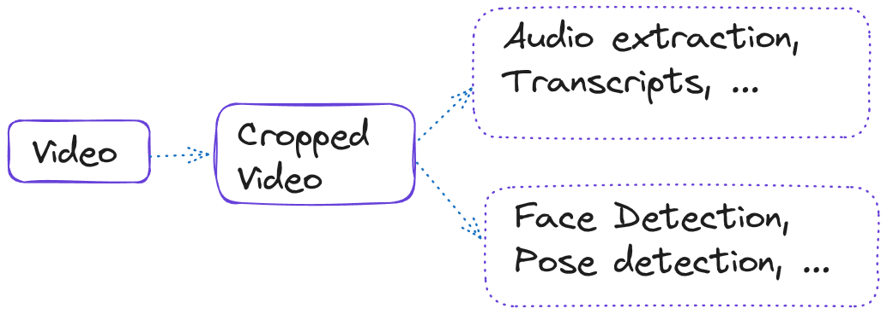
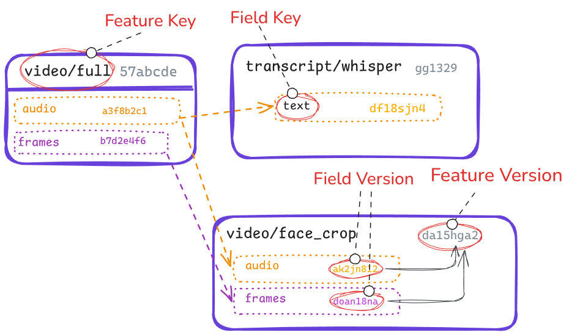

# Solving Multi-Modal Pipelines with Dagster and Metaxy
## The little change

My name is Daniel Gafni, I am an MLOps engineer at [Anam](https://anam.ai).

At [Anam](https://anam.ai), we are providing a platform for building and customizing real-time AI personas. One of the key components powering our product is the face generation model.

We train our own real-time face generation models, which in turn requires custom training datasets: we run all sorts of pre-processing steps on video and audio data, extract embeddings with ML models, use external APIs for annotation and data synthesis, and so on.

A few months ago we decided to introduce a little change into the data preparation pipeline. At that time, we were using a custom data versioning system which tracked a version for each sample. The system could compute a fingerprint for each step based on a manually specified `code_version` on the upstream steps (sounds familiar?). The only difference with Dagster's data versions was the granularity level: we computed it for each *row* in the dataset.

The change we wanted to introduce was very simple: we wanted to crop our videos at a new resolution. This implied changing the `code_version` of the cropping step, and the downstream steps would be re-computed automatically. However, we also noticed an unpleasant outcome. Right after the cropping step, our pipeline was branching into two regions:



Half of the downstream steps were not even using the cropped video frames. They only operated on the audio part. But our data versioning system was unaware of this detail and would re-compute them anyway. This means running our custom audio models on the entire training dataset. That's very expensive and absolutely unnecessary.

This was the moment I realized there was something wrong with our naive approach to data versioning. The idea of Metaxy - the project we are going to discuss in this blog post - was born.
## A glimpse into multi-modal data

As the software world is being eaten by AI, more teams and organizations are starting to interact with multi-modal data pipelines. Unlike traditional tabular workflows, these pipelines are not dealing just with tables, but rather with texts, images, audio, video, vector embeddings, medical data, and so on.

Multi-modal data pipelines can be very unique, with requirements and complexity varying from one use case to another. Calling AI APIs over HTTP, running local ML inference, or simply invoking `ffmpeg` - but they have something in common: they're expensive.

When a tabular pipeline gets re-executed, it typically doesn't cost much. Surely, Big Data exists, and Spark jobs can query petabytes of tabular data, but in reality very few teams run into these challenges. That's the reason behing the Small Data movement success 95% of organizations have less than 1 TB of data! Therefore, re-running a tabular pipeline is typically fine. It's also much easier than to implement incremental workflows. Most of Dagster users don't even need to set up table-level data versioning.

Multi-modal pipelines are a whole different beast. They require a few orders of magnitude more compute and data movement. Accidentally re-running your Whisper voice transcription step on the whole dataset? Congratulations: you've just wasted $10k!

That's why with multi-modal pipelines, implementing incremental approaches is a strict requirement rather than an option. And turns out, it's damn complicated.
## Dagster & Incremental Pipelines
Here are a few factors contributing to increment resolution complexity:
- individual sample  have to be tracked as they flow though the pipeline, the pipeline itself being a DAG
- rather than tracking tabular metadata - which is easy to access for e.g. hashing, we mostly care about the data sample itself
- partial data updates have to be handled, and it's not clear how to do it in the general case

As someone who has been working with multi-modal data for the last three years, I've been running into these problems far too many times. Can Dagster provide as solution here? It turns out, it can't.

### Why Dagster is not enough
Over the course of the last few years, we observed Dagster users who are trying to implement  multi-modal pipelines struggling with this problem over and over. Usually, their thoughts are:
- I need to track pieces of datasets, how can I do it with Dagster? Oh, partitions!
- What does a partition represent in my pipeline? Oh, a file!
- How do I update my partitions automatically? Automation conditions!

It sounds ideal: each sample is modeled as a Dagster partition, Dagster becomes is aware of data updates at the right granularity level, and automation conditions are versatile enough to express nearly any kind of update rules.

That's a trap. While in theory this setup works for low amount of files (or partitions), in practice, users quickly run into limitations, because at scale what Dagster usually considers *metadata* (e.g. partition statuses) becomes *data*! At just ~10k partitions:
- run startup time becomes a huge bottleneck
- performance of various Dagster components - the UI, daemon, and some runtime code - drops to unusable. These components can't be scaled horizontally to handle the load.
- users want to have sample-level metadata available as easily accessible tables, but metadata attached to partition materialization events isn't really structured or exposed this way
- in general, Dagster is getting hijacked into hosting more than just orchestration metadata

And that's completely normal! Dagster wasn't built for this. This problem requires a solution outside of the Dagster world.
### The solution: Metaxy

What Dagster users typically come up next is having their own metadata or state tracking system. They spin up a database next to Dagster and reduce the level of granularity for Dagster assets or partitions.

A partition doesn't have to model a single sample anymore, it can reference thousands or hundreds of thousands of them.

But now users need to do the versioning work outside of Dagster. Re-implementing Dagster's approach to data versioning (merkle hashing) at sample-level granularity is very non-trivial.
## Metaxy

Metaxy is the missing piece connecting the Dagster world - that's only aware of datasets (or their partitions) - with the compute world, which has to deal with individual samples.

Metaxy has two features that make it unique:

1. It is able to track partial data updates.
2. It is agnostic to infrastructure and can be plugged into nearly any data pipeline.

It implements the same approach Dagster takes for computing data versions, but extends it:
- to work in batches, for millions of rows at a time
- to run in a remote database or locally
- to be agnostic to dataframe engines or DBs
- to be aware of *sample components*: instead of being a string, each data version in Metaxy is actually a dictionary.

In short, you can run a few lines of Python code:

```python
with store:
    changes = store.resolve_update("my/feature/key")
```

which does a lot of work behind the scenes:
- joining state tables for upstream steps
- computing expected data versions for each row - **this is the most complicated step**. It is complicated because each version is a dictionary, and each field in the dictionary may depend on it's own subset of upstream fields
- loading the state table for the step being resolved and comparing versions with the expected ones
- returning *new*, *stale* and *orphaned* samples to the user

Once the user gets the `changes` object (by the way - it can be lazy!), they can decide what to do with each category of samples: typically *new* and *stale* are processed again, while *orphaned* may be deleted.

Metaxy solves the "little change" problem by being aware of *partial data dependencies*.

Consider 3 Metaxy *features* (that's how Metaxy calls the data produced at each step): video files (`video/full`), Whisper transcripts (`transcript/whisper`), and video files cropped around the face (`video/face_crop`):



Separate information paths for audio and frames are color-coded. Notice how there are clear *field-level*, or *partial* data dependencies between features. Each *field version* is computed from version of the fields it depends on. Field versions from the same feature are then combined together to produce a *feature version*.

It is obvious that the `text` *field* of the `transcript/whisper` feature only depends on the `audio` *field* of the `video/full` feature. If we decided to resize `video/full` we don't need to recompute `transcript/whisper`.

Metaxy detects this kind of "irrelevant" updates and skips recomputation for downstream features that do not have *fields* affected by upstream changes. This is achieved by recording a separate data version for each field of every sample of every feature.
### The challenge of composability

As was said earlier, incremental pipelines may often run in unique environments, require specific infrastructure, different cloud providers (including neoclouds and compute provides), scaling engines such as Ray or Modal.

One of the goals of Metaxy was to be as versatile and agnostic as Dagster and support this variety of use cases. Metaxy had to be *pluggable* in order to provide value to different users and organizations.

And turns out, this is possible! 95% of metadata management work done by Metaxy is implemented in a way that's agnostic to databases, and can even run locally with Polars or DuckDB!

This is only possible due to **incredible amount of work** that has been put into the Ibis and Narwhals projects. Ibis implements the same Python interface (*not* a typical DataFrame API) for 20+ databases, while Narwhals does the same for different DataFrame engines (Pandas, Polars, DuckDB, Ibis, and more), converging everything to a subset of the Polars API.

Narwhals (or Polars) expressions are the GOAT for programmatic query building. Most of Metaxy's *versioning engine* is implemented in Narwhals expressions, while a few narrow parts had to be pushed back to specific backends.

The importance of this cannot be stressed enough. Entire new generations of *composable data tooling* can be built on top of Narwhals - and of course, none of this would be possible without Apache Arrow.
## Metaxy and Dagster

Of course, Metaxy was designed to be used with Dagster. Not only it took inspiration from Dagster's data versioning design, but it also naturally inherited the same properties (or design goals :)): being declarative and asset-oriented. Just take a look at this API, which should look extremely familiar to any Dagster user:

```python
import metaxy as mx

spec = mx.FeatureSpec(
    key="video/crop",
    id_columns=["id"],
    deps=["video/raw"],
    description="Videos cropped to 720x480.",
    metadata={"team": "ML", "resolution": {"w": 720, "h": 480}},
)
```

Like Dagster, Metaxy has a declarative DSL for defining DAGs, where nodes represent data. They are called *Features* in Metaxy. Metaxy *Features* directly map in Dagster *Assets*.

The `spec` from above can be attached to a *feature class*:

```python
class VideoCrop(mx.BaseFeature, spec=spec):
    path: str
    duration: float
    frame_count: int
```

Now, these *feature definitions* can be trivially integrated with Dagster assets:

```python
import dagster as dg
import metaxy as mx

from metaxy.ext.dagster import metaxify


@metaxify()
@dg.asset(metadata={"metaxy/feature": "video/crop"})
def video_crops(store: mx.MetadataStore):
    with store:
        changes = store.resolve_update("video/crop")

    # handle each sample here, e.g. run `ffmpeg` to crop videos

    with store:
        store.write("video/crop", results)  # results is a DataFrame
```

That's it!

The `@metaxify` decorator here does a lot of heavy lifting, injecting all the information available to Metaxy - and Metaxy knows everything about the feature/asset graph - into the otherwise bare-bones Dagster asset.

Metaxy also integrates with Dagster in a few other ways. A notable mention would be the `MetaxyIOManager`, which allows doing I/O with any of the Metaxy-supported metadata stores, such as DuckDB, DeltaLake, ClickHouse - and you can even use the same code while swapping them for development and production on demand!

Because this integration is so non-invasive and dead simple, Metaxy basically acts as a Dagster plugin for orchestrating individual samples in multi-modal datasets.

## Conclusion
Until now, managing individual files in Dagster pipeline was a cumbersome task. Metaxy makes this easy, allowing Dagster users to focus on transformations.
Dagster and Metaxy elegantly complement each other: the former manages asset-level orchestration and kicks off pipelines calling Metaxy code, while the latter handles row-level orchestration with sub-sample granularity.

Read our docs [here](https://docs.metaxy.io/) and `uv pip install metaxy[dagster]`!
