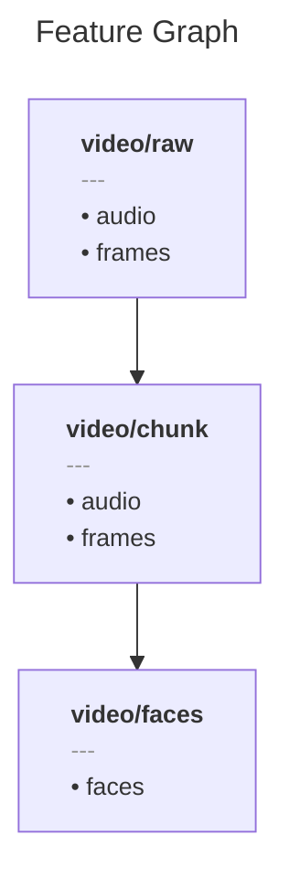

# Expansion

## Overview

::: metaxy-example source-link
example: one-to-many
:::

This example demonstrates how to implement expansion (`1:N`) transformations with Metaxy.
In such relationships a single parent sample can map into multiple child samples.

These relationships can be modeled with [LineageRelationship.expansion][metaxy.models.lineage.LineageRelationship.expansion] lineage type.

We will use a hypothetical video chunking pipeline as an example. We are also going to demonstrate that other Metaxy features such as fields mapping work with non-standard lineage types.

## The Pipeline

We are going to define a typical video processing pipeline with three features:



### Defining features: `Video`

Each video-like feature in our pipeline is going to have two fields: `audio` and `frames`.

Let's set the code version of `audio` to `"1"` in order to change it in the future.
`frames` field will have a default version.

<!-- dprint-ignore-start -->
```python title="src/example_one_to_many/features.py" hl_lines="10"
--8<-- "example-one-to-many/src/example_one_to_many/features.py::16"
```
<!-- dprint-ignore-end -->

### Defining features: `VideoChunk`

`VideoChunk` represents a piece of the upstream `Video` feature. Since each `Video` sample can be split into multiple chunks, we need to tell Metaxy how to map each chunk to its parent video.

<!-- dprint-ignore-start -->
```python title="src/example_one_to_many/features.py" hl_lines="9"
--8<-- "example-one-to-many/src/example_one_to_many/features.py:19:36"
```
<!-- dprint-ignore-end -->

We do not specify custom versions on its fields. Metaxy will automatically assign field-level dependencies by [matching on field names](../reference/api/definitions/fields-mapping.md): `VideoChunk.frames` depends on `Video.frames` and `VideoChunk.audio` depends on `Video.audio`.

### Defining features: `FaceRecognition`

`FaceRecognition` processes video chunks and **only depends on the `frames` field**. This can be expressed with a [`SpecificFieldsMapping`][metaxy.models.fields_mapping.FieldsMapping.specific].

<!-- dprint-ignore-start -->
```python title="src/example_one_to_many/features.py" hl_lines="9-11"
--8<-- "example-one-to-many/src/example_one_to_many/features.py:38:55"
```
<!-- dprint-ignore-end -->

This completes the feature definitions. Let's proceed to running the pipeline.

## Walkthrough

Here is a toy pipeline for computing the feature graph described above:

::: metaxy-example file
example: one-to-many
path: pipeline.py
:::

### Step 1: Launch Initial Run

Run the pipeline to create videos, chunks, and face recognition results:

```bash
python pipeline.py
```

**Output:**

```
Found 3 new videos
Found 3 videos and 0 videos that need chunking
Processing video: {'video_id': 1, ...}
Writing 4 chunks for video 1
Processing video: {'video_id': 2, ...}
Writing 3 chunks for video 2
Processing video: {'video_id': 3, ...}
Writing 5 chunks for video 3
Found 12 video chunks and 0 video chunks that need face recognition
Writing face recognition results for 12 chunks
```

All three features have been materialized. Note that the `VideoChunk` feature may dynamically create as many samples as needed: Metaxy doesn't need to know anything about this in advance, except the relationship type.

### Step 2: Verify Idempotency

Run the pipeline again without any changes:

```bash
python pipeline.py
```

**Output:**

```
Found 0 videos and 0 videos that need chunking
Found 0 video chunks and 0 video chunks that need face recognition
```

Nothing needs recomputation - the system correctly detects no changes.

### Step 3: Change Audio Code Version

Now let's bump the code version on the `audio` field of `Video` feature:

::: metaxy-example patch-with-diff
example: one-to-many
path: patches/01_update_video_code_version.patch
scenario: "Code change - audio field only"
step: "update_audio_version"
:::

This represents updating the audio processing algorithm, and therefore the audio data, while frame data is kept the same.

### Step 4: Observe Field-Level Tracking

Run the pipeline again after the code change:

```bash
python pipeline.py
```

**Output:**

```
Found 3 new videos
Found 3 videos and 0 videos that need chunking
Processing video: {'video_id': 1, ...}
Writing 3 chunks for video 1
Processing video: {'video_id': 2, ...}
Writing 5 chunks for video 2
Processing video: {'video_id': 3, ...}
Writing 4 chunks for video 3
Found 0 video chunks and 0 video chunks that need face recognition
```

**Key observation:**

- `VideoChunk` has been recomputed since the `audio` field on it has been affected by the upstream change
- `FaceRecognition` did not require a recompute, because it only depends on the `frames` field (which did not change)

## Conclusion

Metaxy provides a convenient API for modeling expansion relationships: [LineageRelationship.expansion][metaxy.models.lineage.LineageRelationship.expansion]. Other Metaxy features such as field-level versioning continue to work seamlessly when declaring expansion relationships.

## Related materials

Learn more about:

- [Features and Fields](../guide/learn/feature-definitions.md)
- [Relationships](../guide/learn/relationship.md)
- [Fields Mapping](../guide/learn/syntactic-sugar.md#fields-mapping)
