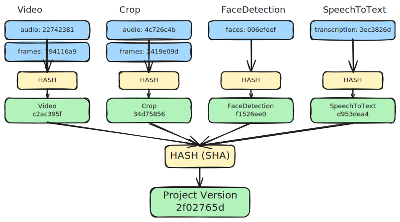

# Versioning

Metaxy calculates a few types of versions at [feature](#feature-level), [field](#field-level), and [sample](#samples) levels.

Metaxy's versioning system is declarative, static (1) and deterministic.
{ .annotate }

1. Versions can be calculated ahead of time (before the data processing job is executed).

Metaxy uses hashing algorithms to compute all versions. The algorithm and the hash [length](../../reference/configuration.md#metaxy.config.MetaxyConfig.hash_truncation_length) can be configured.

Here is how these versions are calculated, from bottom to top.

### Definitions

These versions can be computed from Metaxy definitions (e.g. Python code or historical snapshots of the feature graph). We don't need to access the metadata store in order to calculate them. They exist in Python at runtime, and are also serialized to the metadata store when `metaxy push` is called.

#### Field Level

**Field Code Version** is defined on the field and is provided by the user (defaults to `"__metaxy_initial__"`). Apart from [overriding data versions](#data-version), this is the only input to the versioning system that can be directly modified by the user.

> [!NOTE] Code Version Value
> The value can be an arbitrary string, but in the future we might implement something around semantic versioning.

**Field Version** is computed from the code version of this field, the fully qualified field path and from the field versions of its [parent fields](./definitions/features.md#field-level-lineage) (if any exist, for example, fields on root features do not have dependencies).

???+ info "Visualization"
    

#### Feature Level

**Feature Version**: is computed from the **Field Versions** of all fields defined on the feature and the key of the feature.

???+ info "Visualization"
    

This version is stored as `metaxy_feature_version` [system column](/reference/system-columns.md).

**Feature Code Version** is computed from the **Field Code Versions** of all fields defined on the feature. Unlike _Feature Version_, this version does not change when dependencies change. The value of this version is determined entirely by user input.

#### Project Level

**Project Version**: is computed from the **Feature Versions** of all features in the [Metaxy project](./projects.md).

???+ info "Visualization"
    

??? "How is project version used?"

    This value is used to uniquely encode versioned feature graph topology. `metaxy push` CLI can be used to keep track of previous versions of the feature graph, enabling features such as data version reconciliation migrations.

This version is stored as `metaxy_project_version` [system column](/reference/system-columns.md).

### Samples

These versions are sample-level and require access to the metadata store in order to be computed. They are stored separately for each row in the feature table.

#### Provenance

**Provenance By Field** is computed from the upstream **Provenance By Field** (with respect to defined [field-level lineage](./definitions/features.md#field-level-lineage) and the code versions of the current fields. This is a dictionary mapping sample field names to their respective versions. This is how this looks like in the metadata store (database):

| id        | metaxy_provenance_by_field                    |
| --------- | --------------------------------------------- |
| video_001 | `{"audio": "a7f3c2d8", "frames": "b9e1f4a2"}` |
| video_002 | `{"audio": "d4b8e9c1", "frames": "f2a6d7b3"}` |
| video_003 | `{"audio": "c9f2a8e4", "frames": "e7d3b1c5"}` |
| video_004 | `{"audio": "b1e4f9a7", "frames": "a8c2e6d9"}` |

**Sample Provenance** is derived from the **Provenance By Field** by simply hashing it.

Computing this value is the goal of the entire versioning engine. It's a string value that only changes when versions of the specific upstream fields the sample depends on change. It acts as source of truth for resolving incremental updates for feature metadata.

Most of the time `metaxy_provenance_by_field` and `metaxy_provenance` are used for the final [data version](#data-version) columns as is, except when the user wants to override the latter. These final versions are then recursively used to compute downstream provenances.

???+ info "Visualization"
    

These versions are stored as `metaxy_provenance_by_field` and `metaxy_provenance` [system columns](/reference/system-columns.md).

#### Data Version

Users can override the computed sample-level versions (`metaxy_provenance_by_field`) by setting `metaxy_data_version_by_field` on their metadata, effectively providing a **Data Version** for the sample. This can be used for preventing unnecessary downstream updates, if the computed sample stays the same even after upstream data has changed. `metaxy_data_version_by_field` is then used to compute `metaxy_data_version` by hashing all the fields together.

For example, the data version can be calculated by running `sha256` over the file, or a [perceptual hashing](https://en.wikipedia.org/wiki/Perceptual_hashing) method for images and videos.

This customization only affects how downstream increments are calculated, as the data version cannot be known until the feature is computed.

These versions are stored as `metaxy_data_version_by_field` and `metaxy_data_version` [system columns](/reference/system-columns.md).

#### Provenance Vs Data Version

To summarize, `metaxy_provenance` and `metaxy_provenance_by_field` are used to determine whether the *current feature* has to be updated. Usually they are used for `metaxy_data_version` and `metaxy_data_version_by_field`, but the user can override this. These columns in turn are used to calculate provenances for *downstream* features.

## Example: Partial Data Updates

!!! tip "This example makes use of Metaxy's syntactic sugar."

Consider a video processing pipeline with these features:

```python
import metaxy as mx


class Video(
    mx.BaseFeature,
    spec=mx.FeatureSpec(
        key="example/video",
        id_columns=["video_id"],
        fields=[
            mx.FieldSpec(key="audio", code_version="1"),
            mx.FieldSpec(key="frames", code_version="1"),
        ],
    ),
):
    """Video metadata feature (root)."""

    video_id: str
    frames: int
    duration: float
    size: int


class Crop(
    mx.BaseFeature,
    spec=mx.FeatureSpec(
        key="example/crop",
        id_columns=["video_id"],
        deps=[Video],
        fields=[
            mx.FieldSpec(key="audio", code_version="1"),  # (1)!
            mx.FieldSpec(key="frames", code_version="1"),  # (2)!
        ],
    ),
):
    video_id: str  # ID column


class FaceDetection(
    mx.BaseFeature,
    spec=mx.FeatureSpec(
        key="example/face_detection",
        id_columns=["video_id"],
        deps=[Crop],
        fields=[
            mx.FieldSpec(
                key="faces",
                code_version="1",
                deps=[mx.FieldDep(feature=Crop, fields=["frames"])],
            ),
        ],
    ),
):
    video_id: str


class SpeechToText(
    mx.BaseFeature,
    spec=mx.FeatureSpec(
        key="example/stt",
        id_columns=["video_id"],
        deps=[Video],
        fields=[
            mx.FieldSpec(
                key="transcription",
                code_version="1",
                deps=[mx.FieldDep(feature=Video, fields=["audio"])],
            ),
        ],
    ),
):
    video_id: str
```
{ .annotated }

1. This `audio` field [automatically depends][metaxy.models.fields_mapping.FieldsMapping.default] on the `audio` field of the `"example/video"` feature, because their names match.

2. This `frames` field [automatically depends][metaxy.models.fields_mapping.FieldsMapping.default] on the `frames` field of the `"example/video"` feature, because their names match.

Running `metaxy graph render --format mermaid` produces this graph:

::: metaxy-example graph
    example: overview
    scenario: "Initial feature graph"
    direction: LR

### Tracking Definitions Changes

Imagine the `audio` field of the `"example/video"` feature changes (1):
{ .annotate }

1. зerhaps, something like denoising has been applied

::: metaxy-example patch
    example: overview
    path: patches/01_update_audio_version.patch

Here is how the change affects feature and field versions through the feature graph:

::: metaxy-example graph-diff
    example: overview
    scenario: "Code change - audio field"
    step: "update_audio_version"
    direction: LR

!!! info

    - `"example/video"`, `"example/crop"`, and `"example/stt"` have changed

    - `"example/face_detection"` remained unchanged (depends only on `frames` and not on `audio`)

    - Audio field versions have changed throughout the graph

    - Frame field versions have stayed the same

## Incremental Computations

The single most important piece of code in Metaxy is the [`resolve_update`][metaxy.MetadataStore.resolve_update] method. For a given feature, it takes the inputs (1), computes the expected provenances for the given feature, and compares it with the current state in the metadata store. Learn more about this process [here](./metadata-stores.md#increment-resolution).
{ .annotate }

1. metadata from the upstream features

The Python pipeline needs to handle the result of `resolve_update` call:

<!-- skip: next -->

```python
with store:  # MetadataStore
    # Metaxy computes provenance_by_field and identifies changes
    increment = store.resolve_update(DownstreamFeature)

    # Process only the changed samples
```

The `increment` object has attributes for new upstream samples, samples identified as stale, and samples that have been removed from the upstream metadata.
