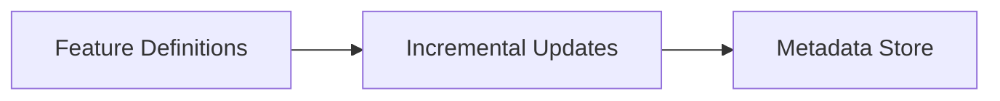

# Concepts

Metaxy is built around a few core ideas that work together to solve the problem of incremental processing in multi-modal pipelines.

## The Big Picture

**Feature definitions** declare what data you have and how it depends on other data. Metaxy builds a **feature graph** from these definitions and uses it to track **versions** at the sample level. When upstream data changes, Metaxy identifies exactly which downstream samples need recomputation and resolves **incremental updates**. All of this is persisted in a **metadata store**. Feature definitions may optionally define custom **metadata columns** (such as file path, size, etc.) which are stored alongside the versioning information.

## Core Concepts

- :material-database-outline: **[Metadata Stores](metadata-stores.md)**

  ---

  Unified interface for storing and retrieving metadata across different backends.

- :material-file-tree-outline: **[Feature Definitions](./definitions/features.md)**

  ---

  Declarative specifications that define your data schema, (partial) dependencies, and how versions are calculated.

- :material-tag-multiple-outline: **[Versioning](data-versioning.md)**

  ---

  Sample-level version tracking that detects changes and determines what needs recomputation.

- :material-magnify: **[Feature Discovery](feature-discovery.md)**

  ---

  Automatic registration and graph building from feature definitions in your codebase.

## Dependencies and Lineage

- :material-source-branch: **[Lineage Relationship](./definitions/relationship.md)**

  ---

  How features relate to upstream dependencies: one-to-one, one-to-many, or many-to-one.

- :material-help-circle-outline: **[Optional Dependencies](optional-dependencies.md)**

  ---

  Handle missing upstream data gracefully without blocking downstream processing.

- :material-filter-outline: **[Filters](filters.md)**

  ---

  Select subsets of samples for processing based on metadata conditions.

## Advanced Topics

- :material-delete-outline: **[Deletions](deletions.md)**

  ---

  Propagate sample deletions through the feature graph correctly.

- :material-table-column: **[System Columns](system-columns.md)**

  ---

  Reserved columns used internally by Metaxy for versioning and deduplication.

- :material-test-tube: **[Testing](./lifecycle/testing.md)**

  ---

  Patterns and utilities for testing Metaxy features.

