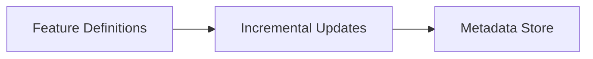

# Concepts

Metaxy is built around a few core ideas that work together to solve the problem of incremental processing in multi-modal pipelines.

## The Big Picture



**Feature definitions** declare what data you have and how it depends on other data. Metaxy builds a **feature graph** from these definitions and uses it to track **versions** at the sample level. When upstream data changes, Metaxy identifies exactly which downstream samples need recomputation and resolves **incremental updates**. All of this is persisted in a **metadata store**. Feature definitions may optionally define custom **metadata columns** (such as file path, size, etc.) which are stored alongside the versioning information.

## Core Concepts

<div class="grid cards" markdown>

- :material-database-outline: **[Metadata Stores](metadata-stores.md)**

  ---

  Unified interface for storing and retrieving metadata across different backends.

- :material-file-tree-outline: **[Feature Definitions](feature-definitions.md)**

  ---

  Declarative specifications that define your data schema, (partial) dependencies, and how versions are calculated.

- :material-tag-multiple-outline: **[Versioning](data-versioning.md)**

  ---

  Sample-level version tracking that detects changes and determines what needs recomputation.

- :material-magnify: **[Feature Discovery](feature-discovery.md)**

  ---

  Automatic registration and graph building from feature definitions in your codebase.

</div>

## Dependencies and Lineage

<div class="grid cards" markdown>

- :material-source-branch: **[Lineage Relationship](relationship.md)**

  ---

  How features relate to upstream dependencies: one-to-one, one-to-many, or many-to-one.

- :material-help-circle-outline: **[Optional Dependencies](optional-dependencies.md)**

  ---

  Handle missing upstream data gracefully without blocking downstream processing.

- :material-filter-outline: **[Filters](filters.md)**

  ---

  Select subsets of samples for processing based on metadata conditions.

</div>

## Advanced Topics

<div class="grid cards" markdown>

- :material-delete-outline: **[Deletions](deletions.md)**

  ---

  Propagate sample deletions through the feature graph correctly.

- :material-table-column: **[System Columns](system-columns.md)**

  ---

  Reserved columns used internally by Metaxy for versioning and deduplication.

- :material-test-tube: **---
title: "Testing Features"
description: "Testing Metaxy features."
---

# Testing Metaxy Features

This guide covers patterns for testing your features when using Metaxy.

## Graph Isolation

By default, Metaxy uses a single global feature [graph][metaxy.FeatureGraph] where all features register themselves automatically.
During testing, you might want to construct your own, clean and isolated graphs.

### Using Isolated Graphs

Always use isolated graphs in tests:

```python
import pytest
import metaxy as mx
from metaxy.models.feature import FeatureGraph


@pytest.fixture(autouse=True)
def isolated_graph():
    with FeatureGraph().use() as g:
        yield g


def test_my_feature(isolated_graph: FeatureGraph):
    class TestFeature(mx.BaseFeature, spec=mx.FeatureSpec(key="test/feature", id_columns=["id"])):
        id: str

    # Test operations here
    assert isolated_graph.get_spec("test/feature") is not None
```

The context manager ensures all feature registrations within the block use the test graph instead of the global one.
Multiple graphs can exist at the same time, but only one will be used for feature registration.

### Graph Context Management

The active graph uses context variables to support multiple graphs:

```python
from metaxy.models.feature import FeatureGraph

# Create a new graph instance
custom_graph = FeatureGraph()

# Get active graph (returns the currently active context)
active = FeatureGraph.get_active()

# Use custom graph temporarily
with custom_graph.use():
    # All operations use custom_graph
    assert FeatureGraph.get_active() is custom_graph
```

This enables:

- **Isolated testing**: Each test gets its own feature registry
- **Migration testing**: Load historical graphs for migration scenarios
- **Multi-environment testing**: Test different feature configurations

## Testing Metadata Store Operations

### Testing with Different Backends

Use parametrized tests to verify behavior across backends:

```python
import pytest
from metaxy.metadata_store.delta import DeltaMetadataStore
from metaxy.metadata_store.duckdb import DuckDBMetadataStore


@pytest.mark.parametrize(
    "store_cls",
    [
        DeltaMetadataStore,
        DuckDBMetadataStore,
    ],
)
def test_store_behavior(store_cls, tmp_path):
    # Use tmp_path for file-based stores
    if store_cls == DeltaMetadataStore:
        store_kwargs = {"root_path": tmp_path / "delta_store"}
    else:
        store_kwargs = {"database": tmp_path / "test.db"}

    with store_cls(**store_kwargs) as test_store:
        # Test your feature operations
        pass
```

### Suppressing AUTO_CREATE_TABLES Warnings

When testing with `auto_create_tables=True`, Metaxy emits warnings to remind you not to use this in production. These warnings are important for production safety, but can clutter test output.

To suppress these warnings in your test suite, use pytest's `filterwarnings` configuration:

```toml
# pyproject.toml
[tool.pytest.ini_options]
env = [
  "METAXY_AUTO_CREATE_TABLES=1", # Enable auto-creation in tests
]
filterwarnings = [
  "ignore:AUTO_CREATE_TABLES is enabled:UserWarning", # Suppress the warning
]
```

The warning is still emitted (important for production awareness), but pytest filters it from test output.

**Testing the Warning Itself**

If you need to verify that the warning is actually emitted, use `pytest.warns()`:

```python
import pytest


def test_auto_create_tables_warning():
    with pytest.warns(UserWarning, match=r"AUTO_CREATE_TABLES is enabled.*do not use in production"):
        with DuckDBMetadataStore(":memory:", auto_create_tables=True) as store:
            pass  # Warning is emitted and captured
```

This works even with `filterwarnings` configured, because `pytest.warns()` explicitly captures and verifies the warning.

### Programmatic Metaxy Configuration

When configuring Metaxy programmatically in Python code, use the following pattern (we also showcase plugin configuration):

```python
from metaxy.config import MetaxyConfig
from metaxy.ext.sqlmodel import SQLModelPluginConfig

with MetaxyConfig(
    ext={
        "sqlmodel": SQLModelPluginConfig(
            enable=True,
            inject_primary_key=True,
        )
    }
).use() as cfg:
    sqlmodel_config = MetaxyConfig.get_plugin("sqlmodel", SQLModelPluginConfig)
    assert sqlmodel_config.inject_primary_key is True
```

When testing Metaxy code, it's best if this setup is performed via `pytest` fixtures.

The plugin configuration is accessed via a dictionary where keys are plugin names and values are plugin-specific configuration objects.
**

  ---

  Patterns and utilities for testing Metaxy features.

</div>
