```mermaid
---
title: Propagation Of Changes
---
flowchart TB
    %%{init: {'flowchart': {'htmlLabels': true, 'curve': 'basis'}, 'themeVariables': {'fontSize': '14px'}}}%%

    example_video["<div style="text-align:left"><b>example/video</b><br/><font color="#CC0000">bc9ca8</font> → <font
color="#00AA00">6db302</font><br/><font color="#999">---</font><br/>- <font color="#FFAA00">audio</font> (<font
color="#CC0000">227423</font> → <font color="#00AA00">09c839</font>)<br/>- frames (794116)</div>"]
    style example_video stroke:#FFA500,stroke-width:3px
    example_crop["<div style="text-align:left"><b>example/crop</b><br/><font color="#CC0000">3ac04d</font> → <font
color="#00AA00">54dc7f</font><br/><font color="#999">---</font><br/>- <font color="#FFAA00">audio</font> (<font
color="#CC0000">76c8bd</font> → <font color="#00AA00">f3130c</font>)<br/>- frames (abc790)</div>"]
    style example_crop stroke:#FFA500,stroke-width:3px
    example_face_detection["<div style="text-align:left"><b>example/face_detection</b><br/>1ac83b<br/><font
color="#999">---</font><br/>- faces (2d75f0)</div>"]
    example_stt["<div style="text-align:left"><b>example/stt</b><br/><font color="#CC0000">c83a75</font> → <font
color="#00AA00">066d34</font><br/><font color="#999">---</font><br/>- <font color="#FFAA00">transcription</font> (<font
color="#CC0000">ac412b</font> → <font color="#00AA00">058410</font>)</div>"]
    style example_stt stroke:#FFA500,stroke-width:3px

    example_video --> example_crop
    example_crop --> example_face_detection
    example_video --> example_stt
```

# Metaxy 🌌

Metaxy is a metadata layer for multi-modal Data and ML pipelines that tracks feature versions, dependencies, and data lineage across complex computation graphs.

## What problem exactly does Metaxy solve?

Data, ML and AI pipelines working with multi-modal data such as images, videos, audio or text can be very expensive to process and store. Unlike in traditional data engineering, re-running the whole thing is not an option.

Tracking and propagating changes (e.g. on upstream data update, code update, bug fixes) to (1) only the right subset of all samples and (2) the right subset of features can become incredibly complicated, especially when data changes *partially* (e.g. only a video file has only its audio changed).

As of time of writing, this remains an unsolved problem. But not anymore!

## Metaxy to the rescue

Metaxy builds a *versioned graphs* from feature definitions and tracks version changes:


Metaxy supports incremental computations, sample-level versioning, field-level versioning, and more.

> [!WARNING] Giga Alpha
> This project is as raw as a steak still saying ‘moo.’

Metaxy is:

- **🧩 composable** --- bring your own everything!

    - supports DuckDB, ClickHouse, and **20+ databases** via [Ibis](https://ibis-project.org/)
    - supports **lakehouse storage** formats such as DeltaLake or DuckLake
    - is **agnostic to tabular compute engines**: Polars, Spark, Pandas, and databases thanks to [Narwhals](https://narwhals-dev.github.io/narwhals/)
    - we totally don't care how is the multi-modal **data** produced or where is it stored: Metaxy is responsible for yielding input metadata and writing output metadata

- **🤸 flexible** to work around restrictions consciously:

    - [features](./learn/feature-definitions.md) are defined as [Pydantic](https://docs.pydantic.dev/latest/) models, leveraging Pydantic's type safety guarantees, rich validation system, and allowing inheritance patterns to stay DRY
    - has a **migrations system** to compensate for reconciling data versions and metadata when computations are not desired

- **🪨 rock solid** when it matters:

    - [data versioning](./learn/data-versioning.md) is guaranteed to be **consistent across DBs or in-memory** compute engines. We really have tested this very well!
    - changes to topology, feature versioning, or individual samples **ruthlessly propagate downstream**
    - unique [field-level dependency system](./learn/feature-definitions.md#field-level-dependencies) prevents unnecessary recomputations for features that depend on partial data
    - metadata is **append-only** to ensure data integrity and immutability. Users can perform cleanup if needed (Metaxy provides tools for this).

- **📈 scalable**:

    - supports **feature organization and discovery** patterns such as packaging entry points. This enables collaboration across teams and projects.
    - is built with **performance** in mind: all operations default to **run in the DB**, Metaxy does not stand in the way of metadata flow

- **🧑‍💻 dev friendly**:

    - clean, [intuitive Python API](./learn/feature-definitions.md#syntactic-sugar) that stays out of your way when you don't need it
    - [feature discovery](./learn/feature-discovery.md) system for effortless dependency management
    - comprehensive **type hints** and Pydantic integration for excellent IDE support
    - first-class support for **local development, testing, preview environments, CI/CD**
    - [CLI](./reference/cli.md) tool for easy interaction, inspection and visualization of feature graphs, enriched with real metadata and stats
    - integrations with popular tools such as [SQLModel](./learn/integrations/sqlmodel.md), Dagster, and Ray.
    - [testing helpers](./learn/testing.md) that you're going to appreciate

## Feature Dependencies

Features form a DAG where each feature declares its upstream dependencies. Consider an video processing pipeline:

```python
class Video(
    Feature,
    spec=FeatureSpec(
        key="video",
        fields=[
            FieldSpec(name="frames", code_version=1),
            FieldSpec(name="audio", code_version=1),
        ],
    ),
):
    path: str = Field(description="Path to the video file")
    duration: float = Field(description="Duration of the video in seconds")


class VoiceDetection(
    Feature,
    spec=FeatureSpec(
        key="voice_detection",
        deps=[FeatureDep(feature=Video)],
    ),
):
    path: str = Field(description="Path to the voice detection json file")
```

> [!NOTE]
> This API will be improved with more ergonomic alternatives.
> See [issue #70](https://github.com/anam-org/metaxy/issues/70) for details.

When `Video` changes, Metaxy automatically identifies that `VoiceDetection` requires recomputation.

## Versioned Change Propagation

Every feature definition produces a deterministic version hash computed from its dependencies, fields, and code versions. When you modify a feature—whether changing its dependencies, adding fields, or updating transformation logic, Metaxy detects the change and propagates it downstream. This is done on multiple levels: `Feature` (class) level, field (class attribute) level, and of course on row level: each _sample_ in the metadata store tracks the version of _each field_ and the overall (class-level) feature version.

This ensures that when feature definitions evolve, every feature that transitively depends on it can be systematically updated. Because Metaxy supports declaring dependencies on fields, it can identify when a feature _does not_ require recomputation, even if one of its parents has been changed (but only irrelevant fields did). This is a huge factor in improving efficiency and reducing unnecessary computations (and costs!).

Because Metaxy feature graphs are static, Metaxy can calculate data version changes ahead of the actual computation. This enables patterns such as **computation preview** and **computation cost prediction**.

## Typical User Workflow

1. Record Metaxy feature graph in CI/CD (not necessary in non-production environments)

```bash
metaxy graph push
```

2. Use `metaxy.MetadataStore.resolve_update` to identify samples requiring recomputation:

```py
from metaxy import init_metaxy

# discover and load Metaxy features
init_metaxy()

store = (
    ...
)  # can be DuckDBMetadataStore locally and ClickHouseMetadataStore in production
diff = store.resolve_update(VoiceDetection)
```

`metaxy.MetadataStore.resolve_update` runs in the database unless it doesn't support the required hash functions, otherwise it fallbacks to in-memory Polars computation (results are guaranteed to be consistent). The returned object provides Narwhals (backend-agnostic) DataFrames with all the data versions already computed.

3. Handle the computation, this is entirely user-defined, Metaxy is not involved in this step.

```py
if (len(diff.added) + len(diff.changed)) > 0:
    # run your computation, this can be done in a distributed manner
    results = run_voice_detection(diff, ...)
```

4. Record metadata for computed samples, this can be done in a distributed manner as well

```py
store.write_metadata(VoiceDetection, results)
```

We have successfully recorded the metadata for the computed samples.

> [!WARNING] No Uniqueness Checks!
> Metaxy doesn't attempt to perform any deduplication or uniqueness checks for performance reasons. While `MetadataStore.resolve_update` is guaranteed to never return the same versioned sample twice (hey that's the whole point of Metaxy), it's up to the user to ensure that samples are not written multiple times to the metadata store. Configuring deduplication or uniqueness checks in the store (database) is a good idea.

## What's Next?

- Learn more about [Data Versioning](./learn/data-versioning.md)
- Take a look at [CLI reference](./reference/cli.md)
