# Metaxy 🌌

Metaxy is a metadata layer for multi-modal Data and ML pipelines that manages and tracks **metadata**: sample [versions](learn/data-versioning.md), dependencies, and data lineage across complex computational graphs.

It's [agnostic](#about-metaxy) to everything: compute engines, data storage, [metadata storage](learn/metadata-stores.md).

It has no strict infrastructure requirements and can use external databases for computations or run locally.

It can scale to handle large amounts of **big metadata**.

> [!WARNING] Giga Alpha
> This project is as raw as a steak still saying ‘moo.’

## What problem exactly does Metaxy solve?

Data, ML and AI workloads processing **large amounts** of images, videos, audios, texts, or any other kind of data can be very expensive to run.
In contrast to traditional data engineering, re-running the whole pipeline on changes is no longer an option.
Therefore, it becomes crucially important to correctly implement incremental processing and sample-level versioning.

Typically, a **feature** has to be re-computed in one of the following scenarios:

- upstream data changes

- bug fixes or algorithmic changes

But correctly distinguishing these scenarios from cases where the feature **should not** be re-computed is a surprisingly challenging. Here are some of the cases where it would be undesirable:

- merging two consecutive steps into one (refactoring the graph topology)

- **partial data updates**, e.g. changing only the audio track inside a video file

- backfilling metadata from another source

Tracking and propagating these changes correctly to the right subset of samples and features can become incredibly complicated.
Until now, a general solution for this problem did not exist, but this is not the case anymore.

## Metaxy to the rescue

Metaxy solves the first set of problems with a **feature** and **field** dependency system, and the second with a **migrations** system.

Metaxy builds a *versioned graphs* from feature definitions and tracks version changes.
This graph can be snapshotted and saved at any point of time, typically during pipeline deployment.
Here is an example of a graph diff produced by a **code_version** update on the `audio` field of the `example/video` feature:

```mermaid
---
title: Propagation Of Changes
---
flowchart TB
    %%{init: {'flowchart': {'htmlLabels': true, 'curve': 'basis'}, 'themeVariables': {'fontSize': '14px'}}}%%

    example_video["<div style="text-align:left"><b>example/video</b><br/><font color="#CC0000">bc9ca8</font> → <font
color="#00AA00">6db302</font><br/><font color="#999">---</font><br/>- <font color="#FFAA00">audio</font> (<font
color="#CC0000">227423</font> → <font color="#00AA00">09c839</font>)<br/>- frames (794116)</div>"]
    style example_video stroke:#FFA500,stroke-width:3px
    example_crop["<div style="text-align:left"><b>example/crop</b><br/><font color="#CC0000">3ac04d</font> → <font
color="#00AA00">54dc7f</font><br/><font color="#999">---</font><br/>- <font color="#FFAA00">audio</font> (<font
color="#CC0000">76c8bd</font> → <font color="#00AA00">f3130c</font>)<br/>- frames (abc790)</div>"]
    style example_crop stroke:#FFA500,stroke-width:3px
    example_face_detection["<div style="text-align:left"><b>example/face_detection</b><br/>1ac83b<br/><font
color="#999">---</font><br/>- faces (2d75f0)</div>"]
    example_stt["<div style="text-align:left"><b>example/stt</b><br/><font color="#CC0000">c83a75</font> → <font
color="#00AA00">066d34</font><br/><font color="#999">---</font><br/>- <font color="#FFAA00">transcription</font> (<font
color="#CC0000">ac412b</font> → <font color="#00AA00">058410</font>)</div>"]
    style example_stt stroke:#FFA500,stroke-width:3px

    example_video --> example_crop
    example_crop --> example_face_detection
    example_video --> example_stt
```



The key observation here is that `example/face_detection`'s `faces` field **did not receive a new version**, because it does not depend on the `audio` field that has been updated upstream.

## About Metaxy

Metaxy is:

- **🧩 composable** --- bring your own everything!

    - supports DuckDB, ClickHouse, and **20+ databases** via [Ibis](https://ibis-project.org/)
    - supports **lakehouse storage** formats such as DeltaLake or DuckLake
    - is **agnostic to tabular compute engines**: Polars, Spark, Pandas, and databases thanks to [Narwhals](https://narwhals-dev.github.io/narwhals/)
    - we totally don't care how is the multi-modal **data** produced or where is it stored: Metaxy is responsible for yielding input metadata and writing output metadata

- **🤸 flexible** to work around restrictions consciously:

    - [features](./learn/feature-definitions.md) are defined as [Pydantic](https://docs.pydantic.dev/latest/) models, leveraging Pydantic's type safety guarantees, rich validation system, and allowing inheritance patterns to stay DRY
    - has a **migrations system** to compensate for reconciling field provenances and metadata when computations are not desired

- **🪨 rock solid** when it matters:

    - [field provenance](./learn/data-versioning.md) is guaranteed to be **consistent across DBs or in-memory** compute engines. We really have tested this very well!
    - changes to topology, feature versioning, or individual samples **ruthlessly propagate downstream**
    - unique [field-level dependency system](./learn/feature-definitions.md#field-level-dependencies) prevents unnecessary recomputations for features that depend on partial data
    - metadata is **append-only** to ensure data integrity and immutability. Users can perform cleanup if needed (Metaxy provides tools for this).

- **📈 scalable**:

    - supports **feature organization and discovery** patterns such as packaging entry points. This enables collaboration across teams and projects.
    - is built with **performance** in mind: all operations default to **run in the DB**, Metaxy does not stand in the way of metadata flow

- **🧑‍💻 dev friendly**:

    - clean, [intuitive Python API](./learn/syntactic-sugar.md) that stays out of your way when you don't need it
    - [feature discovery](./learn/feature-discovery.md) system for effortless dependency management
    - comprehensive **type hints** and Pydantic integration for excellent IDE support
    - first-class support for **local development, testing, preview environments, CI/CD**
    - [CLI](./reference/cli.md) tool for easy interaction, inspection and visualization of feature graphs, enriched with real metadata and stats
    - integrations with popular tools such as [SQLModel](./learn/integrations/sqlmodel.md), Dagster, and Ray.
    - [testing helpers](./learn/testing.md) that you're going to appreciate

## Feature Dependencies

Features form a DAG where each feature declares its upstream dependencies. Consider an video processing pipeline:

```python
class Video(
    Feature,
    spec=FeatureSpec(
        key="video",
        fields=[
            # simple field with only the key defined and the default code_version used
            "frames",
            # let's version this one!
            FieldSpec(name="audio", code_version="1"),
        ],
    ),
):
    path: str = Field(description="Path to the video file")
    duration: float = Field(description="Duration of the video in seconds")


class VoiceDetection(
    Feature,
    spec=FeatureSpec(
        key="voice_detection",
        deps=[Video],
        fields=[
            "frames",   # dependency automatically mapped into Video.frames
            "audio",  # dependency automatically mapped into Video.audio
        ]
    ),
):
    path: str = Field(description="Path to the voice detection json file")
```

> [!NOTE]
> This API will be improved with more ergonomic alternatives.
> See [issue #70](https://github.com/anam-org/metaxy/issues/70) for details.

When `Video` changes, Metaxy automatically identifies that `VoiceDetection` requires recomputation.

## Versioned Change Propagation

Every feature definition produces a deterministic version hash computed from its dependencies, fields, and code versions.
When you modify a feature—whether changing its dependencies, adding fields, or updating transformation logic, Metaxy detects the change and propagates it downstream.
This is done on multiple levels: `Feature` level, field level, and of course on sample level: each _row_ in the metadata store tracks the version of _each field_ and the feature-level version.

This ensures that when feature definitions evolve, every feature that transitively depends on it can be systematically updated. Because Metaxy supports declaring dependencies on fields, it can identify when a feature _does not_ require recomputation, even if one of its parents has been changed (but only irrelevant fields did).
This is a huge factor in improving efficiency and reducing unnecessary computations (and costs!).

Because Metaxy feature graphs are static, Metaxy can calculate field provenance changes ahead of the actual computation.
This enables patterns such as **computation preview** and **computation cost prediction**.

## Typical User Workflow

### 1. Record Metaxy feature graph in CI/CD

Invoke the `metaxy` CLI:

```bash
metaxy graph push
```

This can be skipped in non-production environments.

### 2. Get a resolved metadata increment from Metaxy

Use `metaxy.MetadataStore.resolve_update` to identify samples requiring recomputation:

```py
import metaxy as mx

# discover and load Metaxy features
mx.init_metaxy()

# can be DuckDBMetadataStore locally and ClickHouseMetadataStore in production
store: mx.MetadataStore = ...
diff = store.resolve_update(VoiceDetection)
```

[`resolve_update`][metaxy.MetadataStore.resolve_update] runs in the database with an optional fallback to use Polars in-memory (and the two workflows are guaranteed to produce consistent results).
The returned object provides [Narwhals](https://narwhals-dev.github.io/narwhals/) lazy dataframes which are backend agnostic -- can run on Polars, Pandas, PySpark, or an extenral DB, and have all the field provenances already computed.

### 3. Run user-defined computation over the metadata increment

Metaxy is not involved in this step at all.

```py
if (len(diff.added) + len(diff.changed)) > 0:
    # run your computation, this can be done in a distributed manner
    results = run_voice_detection(diff, ...)
```

### 4. Record metadata for computed samples

This can be done in a distributed manner as well, and the recommended pattern is to write metadata as soon as it becomes available to avoid losing progress in case of interruptions or failures.

```py
store.write_metadata(VoiceDetection, results)
```

We have now successfully recorded the metadata for the computed samples! Processed samples will no longer be returned by `MetadataStore.resolve_update` during future pipeline runs.

> [!WARNING] No Write Time Uniqueness Checks!
> Metaxy doesn't enforce deduplication or uniqueness checks at **write time** for performance reasons.
> While `MetadataStore.resolve_update` is guaranteed to never return the same versioned sample twice, it's up to the user to ensure that samples are not written multiple times to the metadata store.
> Configuring deduplication or uniqueness checks in the store (database) is a good idea.
> For example, the [SQLModel integration](learn/integrations/sqlmodel.md) can inject a composite primary key on `metaxy_data_version`, `metaxy_created_at` and the user-defined ID columns.
> However, Metaxy only uses the latest version (by `metaxy_created_at`) at **read time**.

## What's Next?

- Learn more about feature [definitions](./learn/feature-definitions.md) or [versioning](./learn/data-versioning.md)

- Use Metaxy [from the command line](./reference/cli.md)

- Learn how to [configure Metaxy](./reference/configuration.md)

- Get lost in our [API Reference](./reference/api/index.md)
