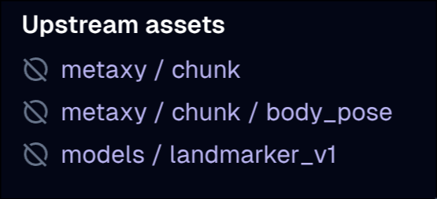
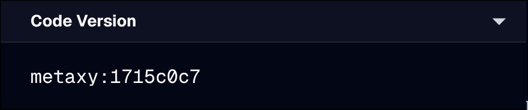
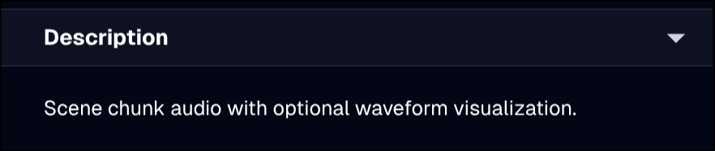
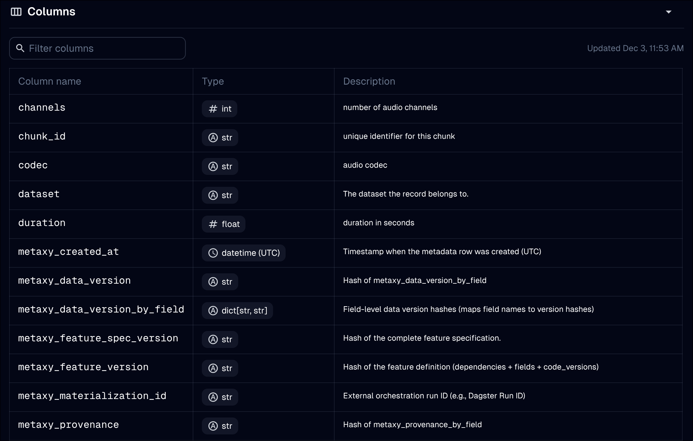

# Metaxify

The [`@metaxify`][metaxy.ext.dagster.metaxify.metaxify] decorator can be used to automatically enrich Dagster assets definitions with information taken from Metaxy features.

It's highly recommended to `@metaxify` all your Dagster assets that **produce Metaxy features**.
It's also recommended to use it in combination with [`MetaxyIOManager`][metaxy.ext.dagster.io_manager.MetaxyIOManager].

`@metaxify` modifies most of the attributes available on the asset spec.

## Deps

Upstream Metaxy features are injected into `deps`.

<!-- dprint-ignore-start -->
=== "Dagster UI"

    

    :man_raising_hand: `models/landmarker_v1` is an upstream non-metaxy Dagster asset.

=== "Code"

    ```py
    import metaxy as mx

    class Chunk(mx.BaseFeature, spec=mx.FeatureSpec(key="chunk", id_columns=["id"])):
        id: str

    class BodyPose(mx.BaseFeature, spec=mx.FeatureSpec(key="body/pose", id_columns=["id"])):
        id: str

    spec = mx.FeatureSpec(key="downstream", id_columns=["id"], deps=[Chunk, BodyPose])
    ```

<!-- dprint-ignore-end -->

## Code Version

Metaxy's feature spec [code version](/guide/concepts/data-versioning.md) is appended to the asset's code version in the format `metaxy:<version>`.



## Description

The Metaxy feature class docstring is used if the asset spec doesn't have a description set.

<!-- dprint-ignore-start -->
=== "Dagster UI"

    

=== "Code"

    ```py
    import metaxy as mx

    class AudioFeature(mx.BaseFeature, spec=mx.FeatureSpec(key="audio/feature", id_columns=["id"])):
        """Scene chunk audio with optional waveform visualization."""
        id: str
    ```
<!-- dprint-ignore-end -->

## Metadata

`@metaxify` injects static metadata into the asset spec.

All [standard metadata](https://docs.dagster.io/guides/build/assets/metadata-and-tags#standard-metadata-types) types are supported. Additionally, `metaxy/info` is added. It contains the Metaxy feature spec, Metaxy project, Metaxy version and enabled Metaxy plugins.

### Column Schema

Pydantic fields schema is injected into the asset metadata under `dagster/column_schema`.
Field types are converted to strings, and field descriptions are used as column descriptions.
If the asset already has a column schema defined, Metaxy columns are appended (user-defined
columns take precedence for columns with the same name).

!!! warning

    Pydantic feature schema may not match the corresponding table schema in the metadata store.
    This will be improved in the future.

<!-- dprint-ignore-start -->
=== "Dagster UI"

    

=== "Code"

    ```py
    import metaxy as mx
    from pydantic import Field

    class AudioFeature(mx.BaseFeature, spec=mx.FeatureSpec(key="audio/feature2", id_columns=["id"])):
        id: str
        duration: float = Field(description="duration in seconds")
        sample_rate: int = Field(description="sample rate in Hz")
        channels: int = Field(description="number of audio channels")
        codec: str = Field(description="audio codec")
    ```
<!-- dprint-ignore-end -->

### Column Lineage

[Column lineage](https://docs.dagster.io/guides/build/assets/metadata-and-tags/column-level-lineage) is injected into the asset metadata under `dagster/column_lineage`.

Tracks which upstream columns each downstream column depends on by analyzing:

- **Direct pass-through**: Columns with the same name in both upstream and downstream features.

- **`FeatureDep.rename`**: Renamed columns trace back to their original upstream column names.

- **`FeatureDep.lineage`**: ID column relationships based on lineage type (identity, aggregation, expansion).

Column lineage is derived from Pydantic model fields on the feature class.
If the asset already has column lineage defined, Metaxy lineage is merged with user-defined
lineage (user-defined dependencies are appended to Metaxy-detected dependencies for each column).

## Kinds

`"metaxy"` kind is injected into asset kinds if `inject_metaxy_kind` is `True` and there are less than 3 kinds currently.

## Tags

`metaxy/feature` and `metaxy/project` are injected into the asset tags.

## Arbitrary Asset Attributes

All keys from `"dagster/attributes"` in the feature spec metadata (such as `group_name`, `owners`, `tags`) are applied to the Dagster asset spec (with replacement).
