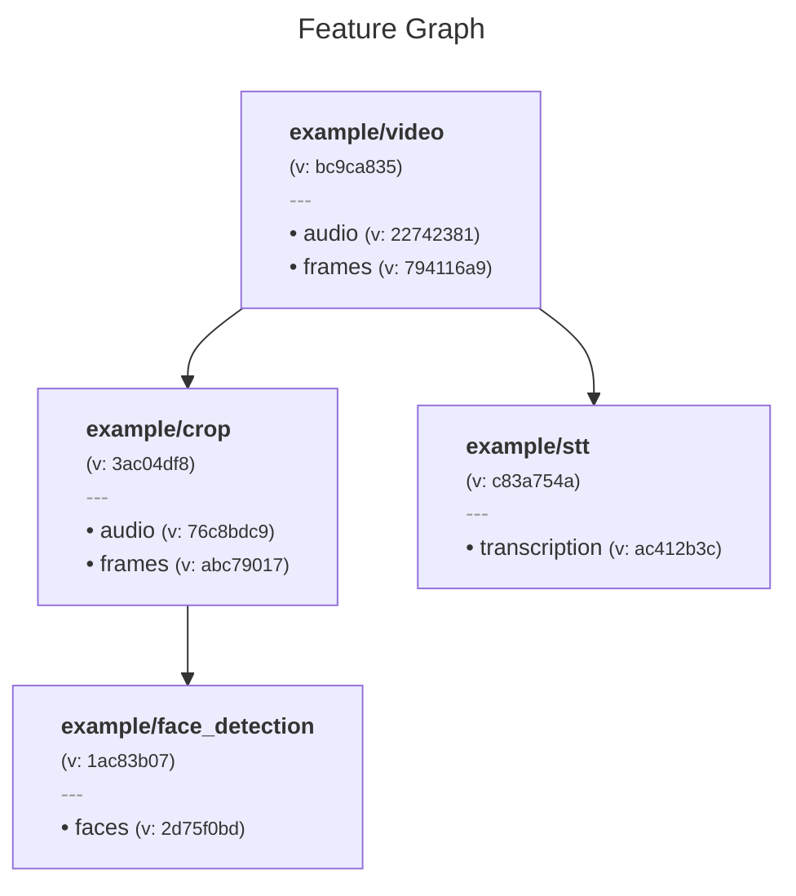
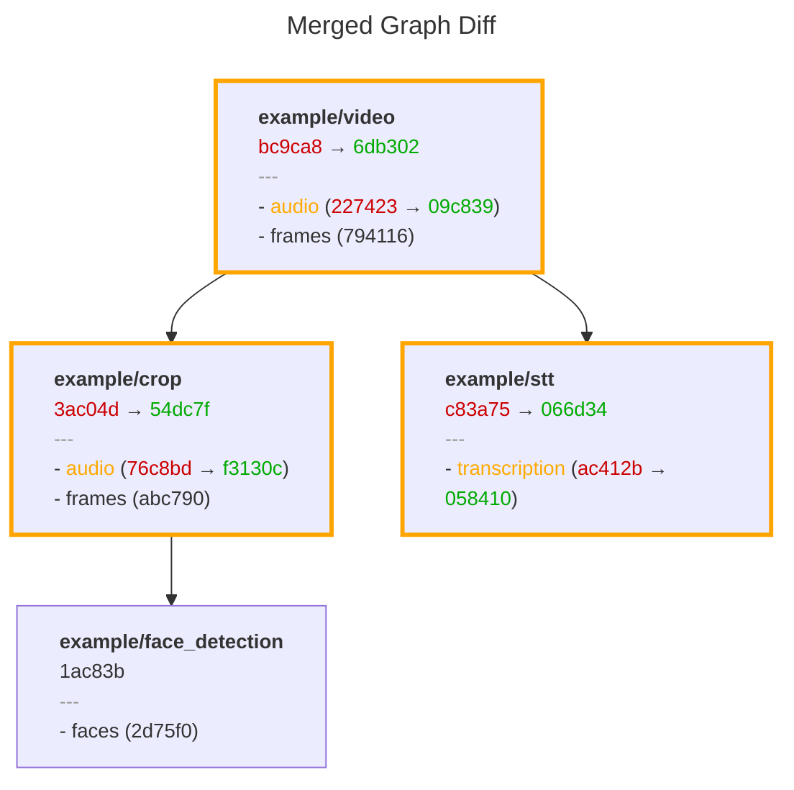

# Versioning

Metaxy calculates a few types of versions at [feature](feature-definitions.md), [field](feature-definitions.md), and sample levels.

Metaxy's versioning system is declarative, static, deterministic and idempotent.

## Versioning

Feature and field versions are defined by the feature graph topology and the user-provided code versions of fields. Sample versions are defined by upstream sample versions and the code versions of the fields defined on the sample's feature.

All versions are computed ahead of time: feature and field versions can be immediately derived from code (and we keep historical graph snapshots for them), and calculating sample versions requires access to the metadata store.

Metaxy uses hashing algorithms to compute all versions. The algorithm and the hash [length](../reference/configuration.md#hash_truncation_length) can be configured.

Here is how these versions are calculated, from bottom to top.

### Definitions

These versions can be computed from Metaxy definitions (e.g. Python code or historical snapshots of the feature graph). We don't need to access the metadata store in order to calculate them.

#### Field Level

- **Field Code Version** is defined on the field and must be provided by the user (defaults to `"0"`).

> [!NOTE] Code Version Value
> The value can be arbitrary, but in the future we might implement something around semantic versioning.

- **Field Version** is computed from the code version of this field, the [fully qualified field path](feature-definitions.md#fully-qualified-field-key) and from the field versions of its [parent fields](feature-definitions.md#field-level-dependencies) (if any exist, for example, fields on root features do not have dependencies).

#### Feature Level

- **Feature Version**: is computed from the **Field Versions** of all fields defined on the feature and the key of the feature.
- **Feature Code Version** is computed from the **Field Code Versions** of all fields defined on the feature. Unlike _Feature Version_, this version does not change when dependencies change. The value of this version is determined entirely by user input.

#### Graph Level

- **Snapshot Version**: is computed from the **Feature Versions** of all features defined on the graph.

> [!NOTE] Why Do We Need Snapshot Version?
> This value is used to uniquely encode versioned feature graph topology in historical snapshots.

### Samples

These versions are sample-level and require access to the metadata store in order to compute them.

- **Sample Version By Field** is computed from the upstream **Sample Version By Fields** (with respect to defined [field-level dependencies](feature-definitions.md#field-level-dependencies) and the code versions of the current fields. This is a dictionary mapping sample field names to their respective versions. This is how this looks like in the metadata store (database):

| sample_uid | metaxy_sample_version_by_field                |
| ---------- | --------------------------------------------- |
| video_001  | `{"audio": "a7f3c2d8", "frames": "b9e1f4a2"}` |
| video_002  | `{"audio": "d4b8e9c1", "frames": "f2a6d7b3"}` |
| video_003  | `{"audio": "c9f2a8e4", "frames": "e7d3b1c5"}` |
| video_004  | `{"audio": "b1e4f9a7", "frames": "a8c2e6d9"}` |

- **Sample Version** is derived from the **Sample Version By Field** by simply hashing it.

This is the end game of the versioning system. It ensures that only the necessary samples are recomputed when a feature version changes. It acts as source of truth for resolving incremental updates for feature metadata.

## Practical Example

Consider a video processing pipeline with these features:

```python
from metaxy import (
    Feature,
    FeatureDep,
    FeatureSpec,
    FieldDep,
    FieldSpec,
)


class Video(
    Feature,
    spec=FeatureSpec(
        key="example/video",
        fields=[
            FieldSpec(
                key="audio",
                code_version="1",
            ),
            FieldSpec(
                key="frames",
                code_version="1",
            ),
        ],
    ),
):
    """Video metadata feature (root)."""

    frames: int
    duration: float
    size: int


class Crop(
    Feature,
    spec=FeatureSpec(
        key="example/crop",
        deps=[FeatureDep(feature=Video)],
        fields=[
            FieldSpec(
                key="audio",
                code_version="1",
                deps=[
                    FieldDep(
                        feature=Video,
                        fields=["audio"],
                    )
                ],
            ),
            FieldSpec(
                key="frames",
                code_version="1",
                deps=[
                    FieldDep(
                        feature=Video,
                        fields=["frames"],
                    )
                ],
            ),
        ],
    ),
):
    pass  # omit columns for the sake of simplicity


class FaceDetection(
    Feature,
    spec=FeatureSpec(
        key="example/face_detection",
        deps=[
            FeatureDep(
                feature=Crop,
            )
        ],
        fields=[
            FieldSpec(
                key="faces",
                code_version="1",
                deps=[
                    FieldDep(
                        feature=Crop,
                        fields=["frames"],
                    )
                ],
            ),
        ],
    ),
):
    pass


class SpeechToText(
    Feature,
    spec=FeatureSpec(
        key="example/stt",
        deps=[
            FeatureDep(
                feature=Video,
            )
        ],
        fields=[
            FieldSpec(
                key="transcription",
                code_version="1",
                deps=[
                    FieldDep(
                        feature=Video,
                        fields=["audio"],
                    )
                ],
            ),
        ],
    ),
):
    pass
```

Running `metaxy graph render --format mermaid` produces this graph:



## Tracking Definitions Changes

Imagine the `audio` field of the `Video` feature changes (perhaps denoising was applied):

```diff
         key="example/video",
         fields=[
             FieldSpec(
                 key="audio",
-                code_version="1",
+                code_version="2",
             ),
```

Run `metaxy graph diff` to see what changed:



Notice:

- `Video`, `Crop`, and `SpeechToText` changed (highlighted)
- `FaceDetection` remained unchanged (depends only on `frames`, not `audio`)
- Audio field versions changed throughout the graph
- Frame field versions stayed the same

## Incremental Computation

The metadata store's `calculate_and_write_data_versions()` method:

1. Joins upstream feature metadata
2. Computes sample versions
3. Compares against existing metadata
4. Returns diff: added, changed, removed samples

Typically, steps 1-3 can be run directly in the database. Analytical databases such as ClickHouse or Snowflake can efficiently handle these operations.

The Python pipeline then processes only the delta

```python
with store:  # MetadataStore
    # Metaxy computes data_version and identifies changes
    diff = store.resolve_update(MyFeature)

    # Process only changed samples
```

The `diff` object has attributes for new upstream samples, samples with new versions, and samples that have been removed from upstream metadata.

This approach avoids expensive recomputation when nothing changed, while ensuring correctness when dependencies update.
