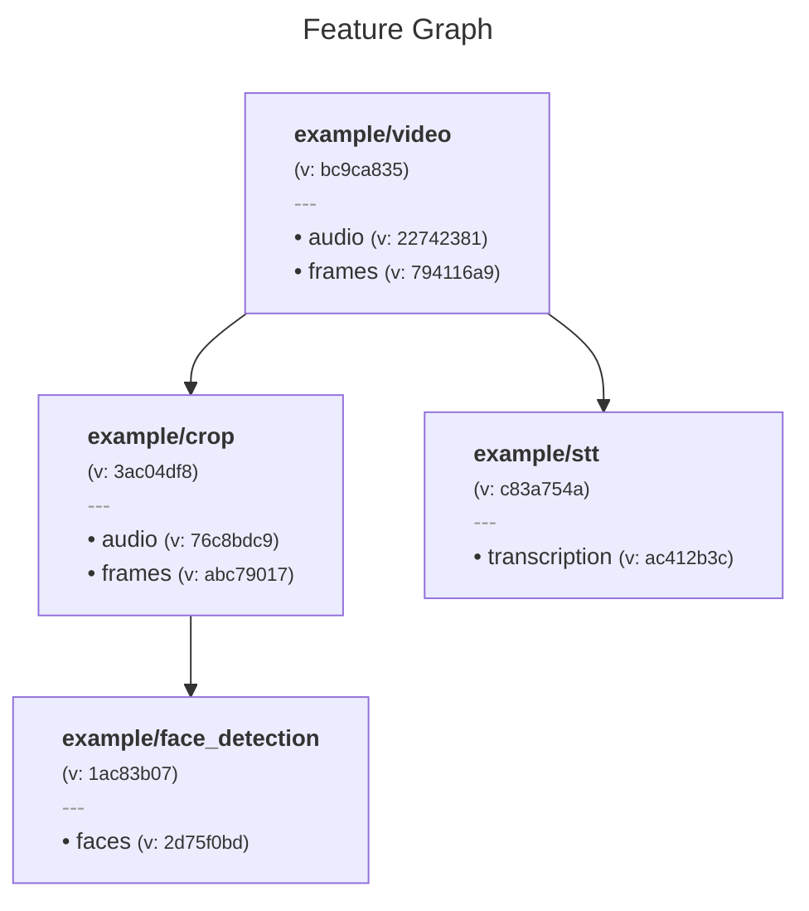
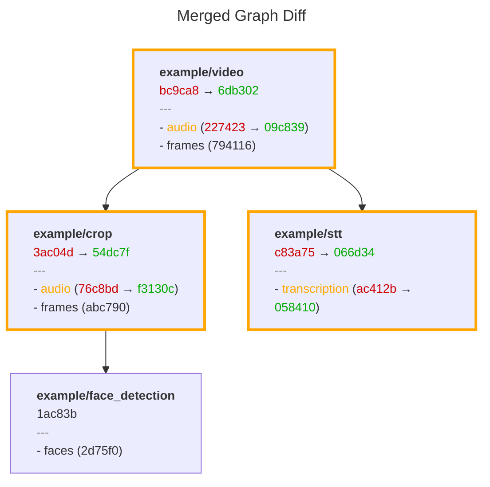

# Data Versioning

Metaxy computes data versions as hashes of upstream dependencies, enabling automatic change detection and incremental computation.

## How It Works

Consider a video processing pipeline with these features:

```python
from metaxy import (
    Feature,
    FeatureDep,
    FeatureKey,
    FeatureSpec,
    FieldDep,
    FieldKey,
    FieldSpec,
)


class Video(
    Feature,
    spec=FeatureSpec(
        key=FeatureKey(["example", "video"]),
        deps=None,  # Root feature
        fields=[
            FieldSpec(key=FieldKey(["audio"]), code_version=1),
            FieldSpec(key=FieldKey(["frames"]), code_version=1),
        ],
    ),
):
    """Video metadata feature (root)."""

    frames: int
    duration: float
    size: int


class Crop(
    Feature,
    spec=FeatureSpec(
        key=FeatureKey(["example", "crop"]),
        deps=[FeatureDep(key=Video.spec.key)],
        fields=[
            FieldSpec(
                key=FieldKey(["audio"]),
                code_version=1,
                deps=[
                    FieldDep(feature_key=Video.spec.key, fields=[FieldKey(["audio"])])
                ],
            ),
            FieldSpec(
                key=FieldKey(["frames"]),
                code_version=1,
                deps=[
                    FieldDep(feature_key=Video.spec.key, fields=[FieldKey(["frames"])])
                ],
            ),
        ],
    ),
):
    pass


class FaceDetection(
    Feature,
    spec=FeatureSpec(
        key=FeatureKey(["example", "face_detection"]),
        deps=[FeatureDep(key=Crop.spec.key)],
        fields=[
            FieldSpec(
                key=FieldKey(["faces"]),
                code_version=1,
                deps=[
                    FieldDep(feature_key=Crop.spec.key, fields=[FieldKey(["frames"])])
                ],
            ),
        ],
    ),
):
    pass


class SpeechToText(
    Feature,
    spec=FeatureSpec(
        key=FeatureKey(["example", "stt"]),
        deps=[FeatureDep(key=Video.spec.key)],
        fields=[
            FieldSpec(
                key=FieldKey(["transcription"]),
                code_version=1,
                deps=[
                    FieldDep(feature_key=Video.spec.key, fields=[FieldKey(["audio"])])
                ],
            ),
        ],
    ),
):
    pass
```

Running `metaxy graph render --format mermaid` produces this graph:



## Tracking Changes

Imagine the `audio` field of the `Video` feature changes (perhaps denoising was applied):

```diff
         key=FeatureKey(["example", "video"]),
         deps=None,
         fields=[
             FieldSpec(
                 key=FieldKey(["audio"]),
-                code_version=1,
+                code_version=2,
             ),
```

Run `metaxy graph diff` to see what changed:



Notice:

- `Video`, `Crop`, and `SpeechToText` changed (highlighted)
- `FaceDetection` remained unchanged (depends only on `frames`, not `audio`)
- Audio field versions changed throughout the graph
- Frame field versions stayed the same

Metaxy's static graph analysis identifies features out of sync after topology changes or code version bumps. Beyond feature and field-level versions, Metaxy computes sample-level versions ahead of computation through the entire graph, enabling processing cost prediction and automatic migrations.

## Sample-Level Versioning

For each sample (row) in your dataset, Metaxy computes a data version by hashing upstream dependency versions. This happens before the actual computation.

Example metadata row:

```python
{
    "sample_uid": "video_001",
    "data_version": {
        "audio": "a2ha72a",
        "frames": "ja812hp",
    },
    "feature_version": "nasdh1a",
    "snapshot_version": "def456",
    # User columns
    "path": "/data/video_001.mp4",
    "duration": 120.5,
}
```

When upstream dependencies change, Metaxy recalculates data versions and identifies which samples need recomputation by comparing old versus new versions.

## Incremental Computation

The metadata store's `calculate_and_write_data_versions()` method:

1. Joins upstream feature metadata
2. Computes data version hashes for each sample
3. Compares against existing metadata
4. Returns diff: added, changed, removed samples

Your pipeline processes only the samples that changed:

```python
with store:  # MetadataStore
    # Metaxy computes data_version and identifies changes
    diff = store.resolve_update(MyFeature)

    # Process only changed samples
```

This approach avoids expensive recomputation when nothing changed, while ensuring correctness when dependencies update.

## Version vs Data Version

**Feature version**: Hash of feature definition (code, deps, fields). Static, deterministic from code.

**Data version**: Hash of upstream data versions for a specific sample. Depends on actual data.

**Snapshot version**: Hash of all feature versions in the graph. Represents entire graph state.

A feature version change doesn't necessarily mean all samples need recomputation. Metaxy compares data versions to identify only the affected samples.
