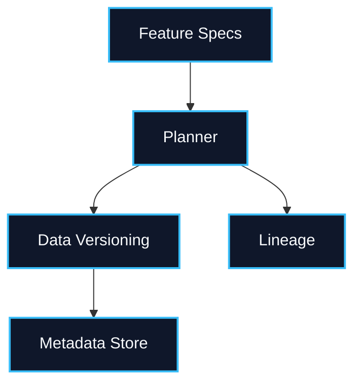

---
# try also 'default' to start simple
theme: default
# random image from a curated Unsplash collection by Anthony
# like them? see https://unsplash.com/collections/94734566/slidev
#background: https://cover.sli.dev
background: /img/race.jpg
# some information about your slides (markdown enabled)
title: Welcome to Metaxy
info: |
  ## Introducing Metaxy
  Rapid feature exploration unlocked - at a budget.

  Learn more at [Metaxy](https://docs.metaxy.io)
# apply UnoCSS classes to the current slide
class: text-center
# https://sli.dev/features/drawing
drawings:
  persist: false
# slide transition: https://sli.dev/guide/animations.html#slide-transitions
transition: slide-left
# enable MDC Syntax: https://sli.dev/features/mdc
mdc: true
# duration of the presentation
duration: 20min
routerMode: hash
---

# Welcome to Metaxy

Accelerating AI experimentation with smart metadata handling without massive cost.

<div @click="$slidev.nav.next" class="mt-12 py-1" hover:bg="white op-10">
  Bridging BI reliability with AI velocity <carbon:arrow-right />
</div>

<div class="abs-br m-6 text-xl">
  <button @click="$slidev.nav.openInEditor()" title="Open in Editor" class="slidev-icon-btn">
    <carbon:edit />
  </button>
  <a href="https://github.com/anam-org/metaxy/tree/main/docs/slides/slides-introduction.md" target="_blank" class="slidev-icon-btn">
    <carbon:logo-github />
  </a>
</div>

<!--
The last comment block of each slide will be treated as slide notes. It will be visible and editable in Presenter Mode along with the slide. [Read more in the docs](https://sli.dev/guide/syntax.html#notes)
-->

---
layout: image-right
image: /img/coffee.jpg
transition: fade-out
---

# Same beans, different brews

> In BI we run daily, idempotent, SQL-centric jobs; in AI we might launch 200 hyper-parameter sweeps per hour.

<br>

- **BI comfort**: curated dashboards and once-a-day refreshes
- **AI reality**: hundreds of experiments, each with bespoke compute footprints

<br>

> **Metaxy** stitches these rhythms together so both sides sip consistent data with minimal cost but rapid experimentation

<style>
h1 {
  background-color: #2B90B6;
  background-image: linear-gradient(45deg, #4EC5D4 10%, #146b8c 20%);
  background-size: 100%;
  -webkit-background-clip: text;
  -moz-background-clip: text;
  -webkit-text-fill-color: transparent;
  -moz-text-fill-color: transparent;
}
</style>

---
layout: two-cols
---

## BI data pipelines

- Predictable triggers and SLA windows
- Centralized SQL engines own execution
- Deterministic outputs feed compliance workflows

::right::

## AI data pipelines

<v-clicks>

- Experimentation across many model variants simultaneously
- Massive, bursty compute outside the data warehouse
- Flexible execution fabrics (GPUs, Ray clusters, notebooks, HPC)
- Non-determinism from stochastic training runs

</v-clicks>

---

# What Metaxy guarantees

<v-clicks>

- **Rapid experimentation** – ship new feature ideas without rewiring lineage
- **Resource conservation** – gate GPU jobs behind metadata diffs
- **Consistency** – trace every artifact back to its upstream inputs

</v-clicks>

<div mt-8 text-muted>
Metaxy brings BI-like observability to the chaos of model iteration.
</div>

---

# Only recompute what matters

- Track feature versions and upstream dependencies automatically
- Transitively recompute only the features whose inputs changed
- Leave untouched metadata in place to save cost
- Surface the minimal change set to orchestrators for targeted runs and integration

---

# Metaxy in action

````md magic-move {lines: true}
```py {1-3|1-5}
from metaxy import init_metaxy
from metaxy.metadata_store.duckdb import DuckDBMetadataStore
from examples.overview.features_1 import FaceDetection

init_metaxy()
```

```py
with DuckDBMetadataStore("metadata.duckdb") as store:
    diff = store.resolve_update(FaceDetection)

    if diff.added.height or diff.changed.height:
        new_rows = run_face_detection(diff)  # user GPU job
```

```py
with DuckDBMetadataStore("metadata.duckdb") as store:
    diff = store.resolve_update(FaceDetection)

    if diff.added.height or diff.changed.height:
        new_rows = run_face_detection(diff)  # user GPU job
        store.write_metadata(FaceDetection, new_rows)
```
````

---
layout: two-cols
---

# System overview

- Planner pulls feature specs
- Joiners align upstream metadata
- Calculators derive fresh data versions
- Diff isolates only the rows worth recomputing before persisting back to the store (DuckDB?)
- Exposes metadata to BI dashboards and orchestrators

::right::



---
layout: center
class: text-center
---

# Learn More

<!-- TODO: we eventually want to use our own logo here - not abuse the one from slidev -->

[Documentation](https://docs.metaxy.io) · [GitHub](https://github.com/anam-org/metaxy/)

<div class="w-60 relative">
  <div class="relative w-40 h-40">
    
    
    
  </div>

<div
    class="text-5xl absolute top-14 left-40 text-[#2B90B6] -z-1"
    v-motion
    :initial="{ x: -80, opacity: 0}"
    :enter="{ x: 0, opacity: 1, transition: { delay: 2000, duration: 1000 } }">
    Metaxy
  </div>
</div>

<!-- vue script setup scripts can be directly used in markdown, and will only affects current page -->
<script setup lang="ts">
const final = {
  x: 0,
  y: 0,
  rotate: 0,
  scale: 1,
  transition: {
    type: 'spring',
    damping: 10,
    stiffness: 20,
    mass: 2
  }
}
</script>
