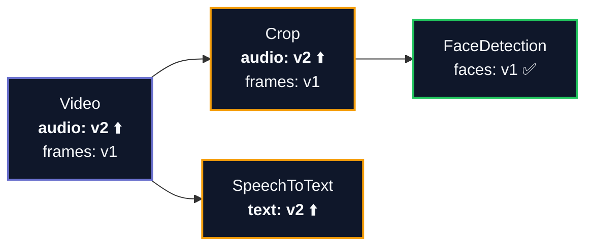
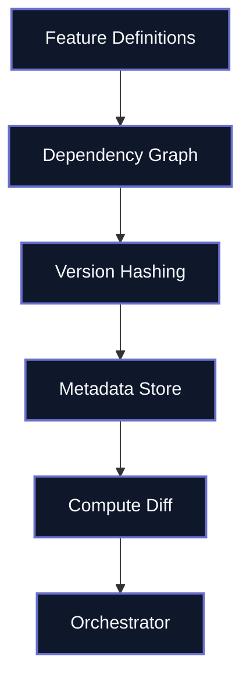

# Metaxy

Streamlining multimodal data handling

<div @click="$slidev.nav.next" class="mt-12 py-1" hover:bg="white op-10">
  Accelerating multimodal AI experimentation without massive cost. <carbon:arrow-right />
</div>

<div class="abs-br m-6 text-xl">
  <button @click="$slidev.nav.openInEditor()" title="Open in Editor" class="slidev-icon-btn">
    <carbon:edit />
  </button>
  <a href="https://github.com/anam-org/metaxy/tree/main/docs/slides/slides-introduction.md" target="_blank" class="slidev-icon-btn">
    <carbon:logo-github />
  </a>
</div>

---
layout: image-right
image: /img/coffee.jpg
transition: fade-out
disabled: true
---

# The $10K Mistake

> Accidentally re-executed your Whisper voice transcription step on the whole dataset?
>
> **Congratulations: $10K just wasted.**

<br>

<v-clicks>

- GPUs cost **10-100x more** than CPUs per hour
- Re-running a tabular pipeline is usually fine
- **Multimodal pipelines are a whole different beast**
- A single careless rerun can blow your weekly budget

</v-clicks>

<style>
h1 {
  background-color: #696FCC;
  background-image: linear-gradient(45deg, #94A9F0 10%, #4644AD 20%);
  background-size: 100%;
  -webkit-background-clip: text;
  -moz-background-clip: text;
  -webkit-text-fill-color: transparent;
  -moz-text-fill-color: transparent;
}
</style>

---
layout: two-cols
disabled: true
---

## BI Pipelines <span text-sm text-muted>(The Old World)</span>

- Run at 2 AM every night
- Everything fits in SQL
- Worst case: rerun takes a couple of hours
- $200/month, all-in
- Single-node XGBoost CPU ML is cheap

::right::

## ML Pipelines <span text-sm text-muted>(The New Reality)</span>

<v-clicks>

- Run many times a day, plus parameter sweeps
- Half the work happens on GPUs outside your warehouse
- Worst case: rerun costs thousands and takes days
- You can't afford to guess what needs recomputing

</v-clicks>

---

# The Problem: A Real Story

At Anam, a simple change to **video cropping resolution** triggered reprocessing of **millions of samples** across the entire pipeline, including audio steps that had nothing to do with frames.

<div class="flex justify-center mt-6">
  
</div>

<v-click>

<div mt-4 text-center>

**Half of the downstream steps didn't even use the cropped video frames.**
They only operated on audio; still the costly video processing had to be rerun.

</div>

</v-click>

---
layout: center
---

# Why Existing Tools Fall Short

<v-clicks>

| Tool | What it does | The gap |
|------|-------------|---------|
| **Dagster / Airflow** | Orchestrate at the asset/table level | Can't see which *fields* changed; partitions don't scale to millions of samples |
| DVC | Version files as opaque artifacts | No record-level or field-level tracking |
| Feast | Serve precomputed features at inference | No dependency graph, no change detection |
| Hamilton | Column-level lineage via Python functions | Table granularity, not record granularity |
| **LanceDB** | Vector storage with versioned datasets | No cross-feature dependency tracking |

</v-clicks>

<v-click>

<div mt-6 text-center text-lg>

All of these operate at **table or file granularity**. None track dependencies at the **field level per record**.

</div>

</v-click>

---

# The Key Insight: Data Fields

Instead of one version per table, Metaxy tracks **separate versions for each field of every record**.

<div class="flex justify-center mt-4">
  
</div>

<div mt-4>

```
video_001: {"audio": "a7f3c2d8", "frames": "b9e1f4a2"}
video_002: {"audio": "c1d5e9f3", "frames": "f7a2b8c4"}
```

</div>

> Each sample carries a versioning dictionary, not a single version string.

---

# Field-Level Dependencies

Features declare which **specific upstream fields** they depend on.

<div class="flex justify-center mt-2">
  
</div>

<div mt-2 text-center>

`SpeechToText.transcription` depends on `Video.audio` only.
Changing frames does not trigger transcription reprocessing.

</div>

---
layout: center
---

# What Changes, What Doesn't

**Scenario:** You bump the `audio` code version from `"1"` to `"2"`.



<v-clicks>

- **FaceDetection**: depends on `Crop.frames` only. **Untouched.** No GPU cost.
- **SpeechToText**: depends on `Video.audio`. **Marked for reprocessing.**
- You just saved half your GPU bill.

</v-clicks>

---

# Show Me the Code

The workflow in 3 steps:

````md magic-move {lines: true}
```py {1-3|5-6}
# 1. Define your features and initialize
import metaxy as mx
from metaxy.metadata_store.duckdb import DuckDBMetadataStore
from my_project.features import FaceDetection

mx.init()  # Discovers and loads your feature definitions
```

```py
# 2. Ask Metaxy what needs recomputing
with DuckDBMetadataStore("metadata.duckdb") as store:
    diff = store.resolve_update(FaceDetection)
    # diff tells you: what's new, what changed, what was removed

    if diff.added.height or diff.changed.height:
        new_rows = run_face_detection(diff)  # Your GPU job runs here
```

```py {1-8|7-8}
# 3. Record the results
with DuckDBMetadataStore("metadata.duckdb") as store:
    diff = store.resolve_update(FaceDetection)

    if diff.added.height or diff.changed.height:
        new_rows = run_face_detection(diff)  # Your GPU job
        store.write_metadata(FaceDetection, new_rows)  # Save metadata
    # Next run will skip these samples
```
````

<div mt-4 text-sm text-muted>

**Key insight:** The expensive GPU work only runs for samples that actually need it.

</div>

---
layout: two-cols
---

# How It Works

**Your code:**

- Define features as Python classes
- Declare field-level dependencies
- Metaxy builds a dependency graph

**The system:**

- Computes version hashes per record per field
- Tracks which samples have which versions
- Pushes computation into the metadata store via SQL

**Your orchestrator:**

- Gets a concrete diff of what changed
- Only schedules GPU jobs for affected samples

::right::

<div class="flex items-center justify-center h-full">



</div>

---

# Works With Your Stack

<v-clicks>

**Storage: start small, scale up**

- Prototype with **DuckDB** on your laptop
- Deploy to **ClickHouse**, **BigQuery**, **Delta Lake**, **LanceDB**, **DuckLake**, or **PostgreSQL**
- Built on **Ibis** + **Narwhals** — adding new backends is straightforward


**Orchestration: pluggable**

- **Dagster** integration with `@metaxify` decorator
- **Ray** for distributed GPU workloads
- Or any orchestrator that can consume a diff

</v-clicks>

---

# Running in Production

<v-clicks>

[Anam](https://anam.ai/blog/metaxy): **millions of samples** in production since Dec 2025, powering **Cara 3** training data.

The pipeline processes raw video and audio through multiple stages:

- Face detection and cropping
- Audio extraction and transcription
- Embedding generation

**Before Metaxy:** A single code change triggered full reprocessing across all stages.

**After Metaxy:** Only the records and fields that actually depend on the change are reprocessed.

</v-clicks>

---
layout: center
class: text-center
---

# Get Started

[Documentation](https://docs.metaxy.io) · [GitHub](https://github.com/anam-org/metaxy/) · [Blog Post](https://anam.ai/blog/metaxy)

```bash
uv pip install metaxy
```

<div class="w-60 relative mt-8">
  <div class="relative w-40 h-40">
    
  </div>

<div
    class="text-5xl absolute top-14 left-40 text-[#696FCC] -z-1"
    v-motion
    :initial="{ x: -80, opacity: 0}"
    :enter="{ x: 0, opacity: 1, transition: { delay: 2000, duration: 1000 } }">
    Metaxy
  </div>
</div>

<script setup lang="ts">
const final = {
  x: 0,
  y: 0,
  rotate: 0,
  scale: 1,
  transition: {
    type: 'spring',
    damping: 10,
    stiffness: 20,
    mass: 2
  }
}
</script>
