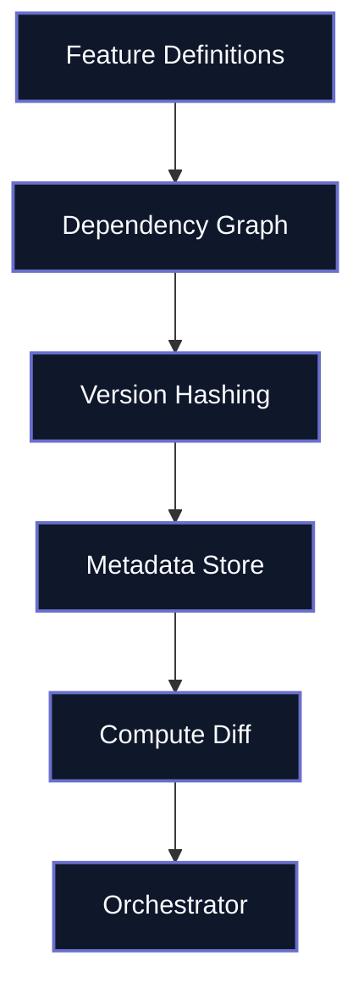

---
# try also 'default' to start simple
theme: default
# random image from a curated Unsplash collection by Anthony
# like them? see https://unsplash.com/collections/94734566/slidev
#background: https://cover.sli.dev
background: /img/race.jpg
# some information about your slides (markdown enabled)
title: Welcome to Metaxy
info: |
  ## Introducing Metaxy
  Rapid feature exploration unlocked - at a budget.

  Learn more at [Metaxy](https://docs.metaxy.io)
# apply UnoCSS classes to the current slide
class: text-center
# https://sli.dev/features/drawing
drawings:
  persist: false
# slide transition: https://sli.dev/guide/animations.html#slide-transitions
transition: slide-left
# enable MDC Syntax: https://sli.dev/features/mdc
mdc: true
# duration of the presentation
duration: 20min
routerMode: hash
# Metaxy brand colors from logo
themeConfig:
  primary: '#696FCC'
---

# Welcome to Metaxy

Accelerating AI experimentation with smart metadata handling without massive cost.

<div @click="$slidev.nav.next" class="mt-12 py-1" hover:bg="white op-10">
  Bridging BI reliability with AI velocity <carbon:arrow-right />
</div>

<div class="abs-br m-6 text-xl">
  <button @click="$slidev.nav.openInEditor()" title="Open in Editor" class="slidev-icon-btn">
    <carbon:edit />
  </button>
  <a href="https://github.com/anam-org/metaxy/tree/main/docs/slides/slides-introduction.md" target="_blank" class="slidev-icon-btn">
    <carbon:logo-github />
  </a>
</div>

<!--
The last comment block of each slide will be treated as slide notes. It will be visible and editable in Presenter Mode along with the slide. [Read more in the docs](https://sli.dev/guide/syntax.html#notes)
-->

---
layout: image-right
image: /img/coffee.jpg
transition: fade-out
---

# GPU Economics

> GPU bills are in a different league.

<br>

**The old world (CPU):**

- Compute was cheap
- CPU reruns were affordable

**The new world (GPU):**

- GPUs cost **10-100× more** than CPUs per hour
- A single experiment might be budget breaking

> **Metaxy** helps you experiment fast without going broke

<style>
h1 {
  background-color: #696FCC;
  background-image: linear-gradient(45deg, #94A9F0 10%, #4644AD 20%);
  background-size: 100%;
  -webkit-background-clip: text;
  -moz-background-clip: text;
  -webkit-text-fill-color: transparent;
  -moz-text-fill-color: transparent;
}
</style>

---
layout: two-cols
---

## BI Pipelines (The Old reality)

- Run at 2 AM every night
- Everything fits in SQL
- Worst case: rerun takes a couple of hours
- $200/month, all-in
- Single-node Xgboost CPU AI is cheap

::right::

## ML Pipelines (The New Reality)

<v-clicks>

- Run many times a day, + parameter sweeps
- Half the work happens on GPUs outside your warehouse
- Worst case: rerun costs a lot and takes several days
- You can't afford to guess what needs recomputing

</v-clicks>

---
layout: center
---

# What **Metaxy** Does For You

<v-clicks>

- **Know what changed** – See exactly which samples need reprocessing before you spin up GPUs
- **Experiment fearlessly** – Update your feature code without worrying about breaking production
- **Cut waste** – Skip redundant GPU work and only recompute what actually changed
- **Stay reproducible** – Track complete lineage so you can explain any model's training data

</v-clicks>

<br>

> Think of it as version control for your feature pipeline metadata.

---

# The Magic: Field-Level Dependencies

**Scenario:** You're processing videos to extract both audio transcripts and face detections.

<v-clicks>

1. You improve your audio denoising algorithm (code change)
2. **Traditional approach:** Rerun everything for all videos = $$$$
3. **Metaxy approach:**
   - Detects that only the audio field changed
   - Face detection depends on video frames, not audio
   - Only reruns transcription, skips face detection
   - Saves a large part of your GPU bill

</v-clicks>

<div mt-4>

**The key:** Metaxy tracks dependencies at the **field level**, not the table level.

</div>

---

# Show Me the Code

The workflow in 3 steps:

````md magic-move {lines: true}
```py {1-3|5-6}
# 1. Define your features and initialize
import metaxy as mx
from metaxy.metadata_store.duckdb import DuckDBMetadataStore
from my_project.features import FaceDetection

mx.init()  # Discovers and loads your feature definitions
```

```py
# 2. Ask Metaxy what needs recomputing
with DuckDBMetadataStore("metadata.duckdb") as store:
    diff = store.resolve_update(FaceDetection)
    # diff tells you: what's new, what changed, what was removed

    if diff.added.height or diff.changed.height:
        new_rows = run_face_detection(diff)  # Your GPU job runs here
```

```py {1-8|7-8}
# 3. Record the results
with DuckDBMetadataStore("metadata.duckdb") as store:
    diff = store.resolve_update(FaceDetection)

    if diff.added.height or diff.changed.height:
        new_rows = run_face_detection(diff)  # Your GPU job
        store.write_metadata(FaceDetection, new_rows)  # Save metadata
    # Next run will skip these samples
```
````

<div mt-4 text-sm text-muted>

**Key insight:** The expensive GPU work only runs for samples that actually need it.

</div>

---
layout: two-cols
---

# How It Works

**Your code:**

- Define features as Python classes
- Declare field-level dependencies
- Metaxy builds a dependency graph

**The system:**

- Computes version hashes (data, code) for every record
- Tracks which samples have which versions
- Manages metadata in SQL including filters (fast!)

**Your orchestrator:**

- Gets a concrete diff of what changed
- Only schedules GPU jobs for affected samples

::right::

<div class="flex items-center justify-center h-full">



</div>

---

# Why Teams Adopt Metaxy

<v-clicks>

**💰 Cut GPU costs**

- One team reduced their weekly GPU spend from $12K to $4K by eliminating redundant reruns

**🚀 Ship features faster**

- Update algorithms without fear of breaking downstream pipelines
- Metadata diffs tell you exactly what will change

**🔍 Actually be reproducible**

- Complete lineage tracking from raw inputs to final predictions
- Audit any experiment months later

**🔌 Works with your stack**

- Start with DuckDB on your laptop
- Deploy to ClickHouse, BigQuery, or 20+ other backends
- Integrates with Dagster, Ray, and your existing orchestration

</v-clicks>

---
layout: center
class: text-center
---

# Learn More

[Documentation](https://docs.metaxy.io) · [GitHub](https://github.com/anam-org/metaxy/)

<div class="w-60 relative">
  <div class="relative w-40 h-40">
    
  </div>

<div
    class="text-5xl absolute top-14 left-40 text-[#696FCC] -z-1"
    v-motion
    :initial="{ x: -80, opacity: 0}"
    :enter="{ x: 0, opacity: 1, transition: { delay: 2000, duration: 1000 } }">
    Metaxy
  </div>
</div>

<script setup lang="ts">
const final = {
  x: 0,
  y: 0,
  rotate: 0,
  scale: 1,
  transition: {
    type: 'spring',
    damping: 10,
    stiffness: 20,
    mass: 2
  }
}
</script>
