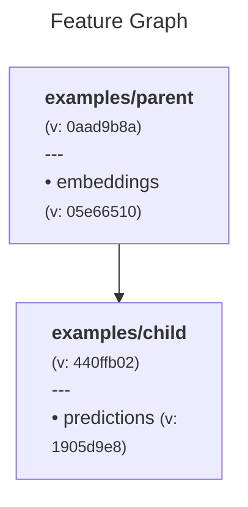

# Migration Example

```mermaid
---
title: Feature Graph
---
flowchart TB
    %% Snapshot version: d49e39c7
        examples_parent["<div style="text-align:left"><b>examples/parent</b><br/><small>(v: 0aad9b8a)</small><br/>---<br/>• embeddings
<small>(v: 05e66510)</small></div>"]
        examples_child["<div style="text-align:left"><b>examples/child</b><br/><small>(v: 440ffb02)</small><br/>---<br/>• predictions <small>(v:
1905d9e8)</small></div>"]
        examples_parent --> examples_child
```
