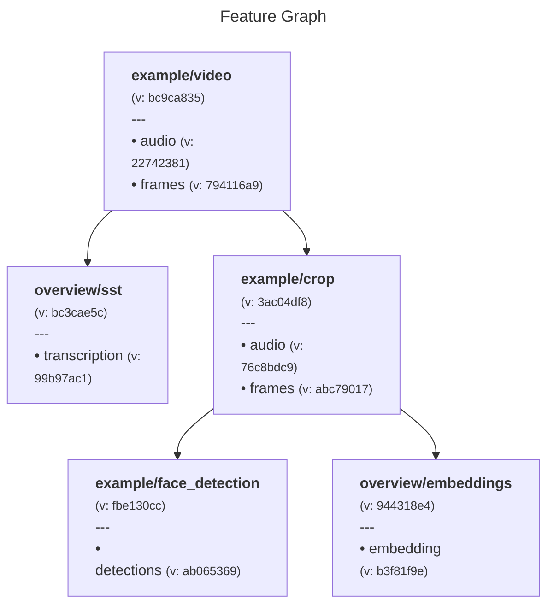

# Overview Example

```mermaid
---
title: Feature Graph
---
flowchart TB
    %% Snapshot version: f3f57b8e
        example_video["<div style="text-align:left"><b>example/video</b><br/><small>(v: bc9ca835)</small><br/>---<br/>• audio <small>(v:
22742381)</small><br/>• frames <small>(v: 794116a9)</small></div>"]
        overview_sst["<div style="text-align:left"><b>overview/sst</b><br/><small>(v: bc3cae5c)</small><br/>---<br/>• transcription <small>(v:
99b97ac1)</small></div>"]
        example_crop["<div style="text-align:left"><b>example/crop</b><br/><small>(v: 3ac04df8)</small><br/>---<br/>• audio <small>(v:
76c8bdc9)</small><br/>• frames <small>(v: abc79017)</small></div>"]
        overview_embeddings["<div style="text-align:left"><b>overview/embeddings</b><br/><small>(v: 944318e4)</small><br/>---<br/>• embedding
<small>(v: b3f81f9e)</small></div>"]
        example_face_detection["<div style="text-align:left"><b>example/face_detection</b><br/><small>(v: fbe130cc)</small><br/>---<br/>•
detections <small>(v: ab065369)</small></div>"]
        example_video --> example_crop
        example_crop --> example_face_detection
        example_video --> overview_sst
        example_crop --> overview_embeddings
```
