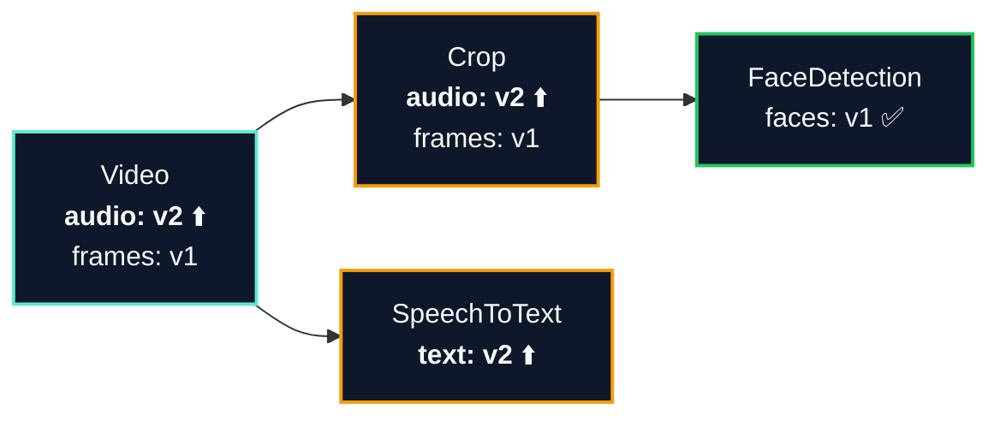
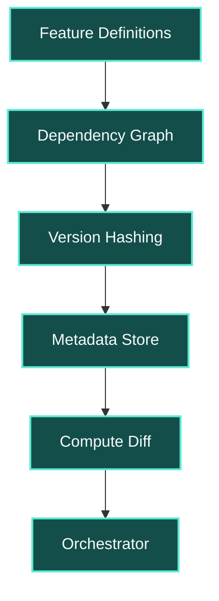

<!-- ──────────────────────────────────────────────────────
     SLIDE 1 · TITLE  (dark navy)
     Conference-agnostic hero — repository URL as anchor.
────────────────────────────────────────────────────── -->
<div class="relative z-10 h-full max-w-6xl mx-auto px-16 py-12 flex flex-col justify-between">
  <div class="flex items-center">
    <div class="eyebrow-light"><a href="https://github.com/anam-org/metaxy" class="hover:text-teal-300">github.com/anam-org/metaxy</a></div>
  </div>
  <div class="grid w-full gap-10" style="grid-template-columns:1.35fr 0.65fr;align-items:start">
    <div class="space-y-5">
      <h1 class="slide-title text-white" style="text-wrap:balance">
        Perfecting the art of <span style="color:#5eead4">doing&nbsp;nothing</span>
      </h1>
      <div class="lead-dark space-y-1" style="text-wrap:balance">
        <p><span style="color:rgba(240,253,250,0.96)">Metaxy</span> — field-level feature metadata.</p>
        <p>Only recompute what actually changed.</p>
      </div>
      <div class="flex items-center gap-5 pt-2">
        <span class="mono-label" style="color:rgba(203,213,225,0.85);letter-spacing:0.08em;font-size:0.68rem">works with</span>
        
        
      </div>
    </div>
    <div class="flex items-start justify-center" style="margin-top:-1rem">
      
    </div>
  </div>
  <div class="flex items-end justify-between gap-6">
    <div class="mono-label" style="color:rgba(94,234,212,0.78);line-height:1.6;letter-spacing:0.04em">
      <a href="https://docs.metaxy.io" class="hover:text-teal-300">docs.metaxy.io</a>
      <br/>
      <code style="color:rgba(240,253,250,0.9)">uv add metaxy</code>
    </div>
    <div class="flex items-center gap-3">
      <div style="height:1px;width:2rem;background:rgba(45,212,191,0.4)" />
      <span class="mono-label text-right" style="color:rgba(94,234,212,0.78);font-size:1.05rem;line-height:1.45;letter-spacing:0.04em">
        <a href="https://gafni.dev/" class="hover:text-teal-300">Daniel Gafni</a> · <a href="https://georgheiler.com/" class="hover:text-teal-300">Georg Heiler</a>
      </span>
    </div>
  </div>
</div>

---
layout: light
---
<!-- ──────────────────────────────────────────────────────
     SLIDE 2 · SPEAKERS  (warm light · joint introduction)
     Two presenters on one slide, ibm-docling photo style.
────────────────────────────────────────────────────── -->
<div class="h-full max-w-6xl mx-auto px-16 py-8 flex flex-col justify-center gap-6">
  <div class="max-w-5xl space-y-1.5">
    <div class="eyebrow">Presenters</div>
    <h1 class="slide-heading" style="text-wrap:balance;font-size:2.4rem">Two practitioners working on the same bottleneck</h1>
    <p class="lead" style="line-height:1.55">Both work on pipelines where small changes can trigger expensive, unnecessary recompute.</p>
  </div>
  <div class="grid w-full gap-10" style="grid-template-columns:1fr 1fr">
    <div class="grid gap-5" style="grid-template-columns:0.45fr 1fr;align-items:start">
      <div class="space-y-2">
        <div class="overflow-hidden rounded-lg aspect-[3/4] bg-neutral-200">
          
        </div>
      </div>
      <div class="space-y-2.5">
        <div>
          <div class="j-serif text-xl text-neutral-950"><a href="https://gafni.dev/" class="underline decoration-teal-700/40 underline-offset-[0.18em]">Daniel Gafni</a> · <a href="https://github.com/danielgafni" class="text-sm text-neutral-600 underline decoration-teal-700/40 underline-offset-[0.14em]">@danielgafni</a></div>
          <div class="mt-0.5 text-xs font-semibold uppercase tracking-[0.2em] text-teal-700/80">Author · Metaxy</div>
        </div>
        <div class="text-xs leading-snug text-neutral-600">
          Ex-ML engineer at <a href="https://anam.ai/" class="underline decoration-teal-700/40 underline-offset-[0.14em]">Anam</a>.
          Started Metaxy after watching multimodal pipelines reprocess millions of samples over trivial code changes.
        </div>
        <div class="border-t border-neutral-300 pt-2 text-xs leading-snug text-neutral-700">
          <span class="mono-label text-neutral-500">Also maintains</span><br/>
          <a href="https://github.com/danielgafni/dagster-ray" class="underline decoration-teal-700/40 underline-offset-[0.14em]">dagster-ray</a>
        </div>
      </div>
    </div>
    <div class="grid gap-5" style="grid-template-columns:0.45fr 1fr;align-items:start">
      <div class="space-y-2">
        <div class="overflow-hidden rounded-lg aspect-[3/4] bg-neutral-200">
          
        </div>
      </div>
      <div class="space-y-2.5">
        <div>
          <div class="j-serif text-xl text-neutral-950"><a href="https://georgheiler.com/" class="underline decoration-teal-700/40 underline-offset-[0.18em]">Georg Heiler</a> · <a href="https://github.com/geoHeil" class="text-sm text-neutral-600 underline decoration-teal-700/40 underline-offset-[0.14em]">@geoHeil</a></div>
          <div class="mt-0.5 text-xs font-semibold uppercase tracking-[0.2em] text-teal-700/80">Contributor · Metaxy</div>
        </div>
        <div class="text-xs leading-snug text-neutral-600">
          Co-founder <a href="https://jubust.com/" class="underline decoration-teal-700/40 underline-offset-[0.14em]">Jubust</a>;
          RSE at <a href="https://ascii.ac.at/" class="underline decoration-teal-700/40 underline-offset-[0.14em]">ASCII</a> /
          <a href="https://csh.ac.at/" class="underline decoration-teal-700/40 underline-offset-[0.14em]">CSH</a>;
          Senior Data Expert at <a href="https://www.magenta.at/" class="underline decoration-teal-700/40 underline-offset-[0.14em]">Magenta</a>.
        </div>
        <div class="border-t border-neutral-300 pt-2 text-xs leading-snug text-neutral-700">
          <span class="mono-label text-neutral-500">Also works on</span><br/>
          <a href="https://docling-project.github.io/docling" class="underline decoration-teal-700/40 underline-offset-[0.14em]">Docling</a> ·
          <a href="https://github.com/ascii-supply-networks/dagster-slurm" class="underline decoration-teal-700/40 underline-offset-[0.14em]">dagster-slurm</a>
        </div>
      </div>
    </div>
  </div>
</div>

---
layout: white
---
<!-- ──────────────────────────────────────────────────────
     SLIDE 3 · WHY NOW  (white · compute has changed)
     Set up the GPU economics problem with the bigger picture.
────────────────────────────────────────────────────── -->
<div class="h-full max-w-6xl mx-auto px-16 py-6 flex flex-col justify-center gap-4">
  <div class="max-w-5xl space-y-2">
    <div class="eyebrow">Why Now</div>
    <h1 class="slide-heading" style="font-size:2.14rem">Modern data workflows branch and iterate</h1>
    <p class="lead max-w-5xl" style="font-size:0.96rem;line-height:1.4">LLM calls and GPU-heavy stages make coarse reruns expensive. Teams increasingly need to compare alternative paths without recomputing everything.</p>
  </div>
  <div class="grid gap-4 items-start" style="grid-template-columns:0.94fr 1.06fr">
    <div class="space-y-0">
      <div class="grid gap-4 border-t border-neutral-300 py-2.5" style="grid-template-columns:110px 1fr">
        <div class="text-sm font-semibold uppercase tracking-[0.22em] text-teal-700">Cost</div>
        <div class="text-sm leading-relaxed text-neutral-700">LLM calls and GPU hours make full reruns expensive.</div>
      </div>
      <div class="grid gap-4 border-t border-neutral-300 py-2.5" style="grid-template-columns:110px 1fr">
        <div class="text-sm font-semibold uppercase tracking-[0.22em] text-teal-700">Legacy</div>
        <div class="text-sm leading-relaxed text-neutral-700">Many data platforms assume one shared state and coarse invalidation.</div>
      </div>
      <div class="grid gap-4 border-t border-neutral-300 py-2.5" style="grid-template-columns:110px 1fr">
        <div class="text-sm font-semibold uppercase tracking-[0.22em] text-teal-700">Agents</div>
        <div class="text-sm leading-relaxed text-neutral-700">Exploratory and agent-driven workflows branch, compare alternatives, and merge after review.</div>
      </div>
      <div class="grid gap-4 border-t border-neutral-300 py-2.5" style="grid-template-columns:110px 1fr">
        <div class="text-sm font-semibold uppercase tracking-[0.22em] text-teal-700">Need</div>
        <div class="text-sm leading-relaxed text-neutral-700">Provenance, incremental recompute, and branch-aware state.</div>
      </div>
    </div>
    <div class="rounded-lg border border-neutral-200 bg-neutral-50 p-3">
      
      <p class="mt-2 text-xs leading-snug text-neutral-600">
        Bauplan: branching analytics can fork shared state into multiple exploration paths.
        <a href="https://arxiv.org/html/2603.13380v1" class="underline decoration-neutral-400/50 underline-offset-[0.14em]">arXiv:2603.13380</a>
      </p>
    </div>
  </div>
</div>

---
layout: light
---
<!-- ──────────────────────────────────────────────────────
     SLIDE 4 · THE PROBLEM  (warm light)
     Concrete, costly, and specific to multimodal work.
────────────────────────────────────────────────────── -->
<div class="h-full max-w-6xl mx-auto px-16 py-10 flex items-center">
  <div class="grid w-full gap-12" style="grid-template-columns:1.3fr 0.8fr;align-items:stretch">
    <div class="flex flex-col justify-end gap-6">
      <div class="space-y-4">
        <div class="eyebrow">The GPU Economics Problem</div>
        <h1 class="slide-heading" style="text-wrap:balance">
          One careless rerun can blow the weekly GPU budget
        </h1>
        <p class="lead">
          Tabular pipelines forgive a full rerun — they finish by morning on CPUs.
          Multimodal pipelines do not. A change to cropping resolution can cascade through millions of
          samples and trigger audio, transcription, and embedding stages that never touched those frames.
        </p>
      </div>
      <div class="teal-callout" style="padding:0.75rem 1rem">
        <div class="mono-label text-teal-700">The scenario Metaxy handles</div>
        <p class="mt-2 text-sm leading-relaxed text-neutral-700">Bump the cropping resolution. Without field-level tracking the full pipeline would reprocess — audio-only stages included. Roughly half those stages never touched a frame.</p>
      </div>
    </div>
    <div class="space-y-0 border-l border-neutral-300 pl-8">
      <div class="border-t border-neutral-300 pt-4 pb-4">
        <div class="text-xs font-semibold uppercase tracking-[0.22em] text-neutral-500">Compute reality</div>
        <div class="j-serif mt-2 text-2xl text-neutral-950">10–100× cost</div>
        <div class="mt-2 text-base leading-relaxed text-neutral-600">GPU hours vs. CPU hours for the same wall-clock window.</div>
      </div>
      <div class="border-t border-neutral-300 pt-4 pb-4">
        <div class="text-xs font-semibold uppercase tracking-[0.22em] text-neutral-500">Iteration reality</div>
        <div class="j-serif mt-2 text-2xl text-neutral-950">Many reruns / day</div>
        <div class="mt-2 text-base leading-relaxed text-neutral-600">Parameter sweeps, model swaps, bugfixes throughout the day.</div>
      </div>
      <div class="border-t border-neutral-300 pt-4 pb-4">
        <div class="text-xs font-semibold uppercase tracking-[0.22em] text-neutral-500">Decision cost</div>
        <div class="j-serif mt-2 text-2xl text-neutral-950">Guessing is expensive</div>
        <div class="mt-2 text-base leading-relaxed text-neutral-600">You cannot afford to guess what needs recomputing. The system has to know.</div>
      </div>
    </div>
  </div>
</div>

---
layout: deep
---
<!-- ──────────────────────────────────────────────────────
     SLIDE 4 · WHY EXISTING TOOLS FALL SHORT  (deep)
     Positioning vs. the rest of the ecosystem.
────────────────────────────────────────────────────── -->
<div class="h-full max-w-6xl mx-auto px-16 py-8 flex flex-col justify-center gap-4">
  <div class="max-w-5xl space-y-1">
    <div class="eyebrow-light">Landscape</div>
    <h1 class="slide-heading text-white" style="text-wrap:balance;font-size:2.3rem">Existing tools stop at the table or the file</h1>
    <p class="text-sm leading-relaxed text-slate-300 max-w-4xl">None of these are wrong. They just operate <em>above</em> the granularity at which GPU cost actually accrues.</p>
  </div>
  <div class="grid gap-3" style="grid-template-columns:1fr 1fr 1fr">
    <div class="stage-card">
      <div class="mono-label text-teal-300">Orchestration</div>
      <div class="j-serif mt-1 text-lg text-white">Dagster · Airflow · Prefect</div>
      <p class="mt-2 text-xs leading-snug text-slate-300">Schedules assets and partitions. Cannot see which <em>fields</em> changed; partitioning does not scale to millions of samples.</p>
    </div>
    <div class="stage-card">
      <div class="mono-label text-teal-300">Artifact versioning</div>
      <div class="j-serif mt-1 text-lg text-white">DVC</div>
      <p class="mt-2 text-xs leading-snug text-slate-300">Files as opaque blobs. No record-level or field-level tracking.</p>
    </div>
    <div class="stage-card">
      <div class="mono-label text-teal-300">Online serving</div>
      <div class="j-serif mt-1 text-lg text-white">Feast</div>
      <p class="mt-2 text-xs leading-snug text-slate-300">Serves precomputed features. No upstream field-level dependency propagation.</p>
    </div>
    <div class="stage-card">
      <div class="mono-label text-teal-300">Functional lineage</div>
      <div class="j-serif mt-1 text-lg text-white">Hamilton</div>
      <p class="mt-2 text-xs leading-snug text-slate-300">Column-level lineage per function. Table granularity only.</p>
    </div>
    <div class="stage-card">
      <div class="mono-label text-teal-300">Versioned datasets</div>
      <div class="j-serif mt-1 text-lg text-white">LanceDB · DataChain</div>
      <p class="mt-2 text-xs leading-snug text-slate-300">Deltas over datasets. No cross-feature graph driving selective recompute.</p>
    </div>
    <div class="stage-card" style="border-color:rgba(94,234,212,0.5);background-color:rgba(94,234,212,0.08)">
      <div class="mono-label text-teal-300">The gap · Metaxy</div>
      <div class="j-serif mt-1 text-lg text-white">Field × record granularity</div>
      <p class="mt-2 text-xs leading-snug text-slate-300">Version propagation at <em>which field</em> × <em>which record</em>.</p>
    </div>
  </div>
  <div class="dark-callout" style="padding:0.5rem 0.75rem">
    <div class="mono-label text-teal-200">Why this granularity</div>
    <div class="mt-1 text-sm leading-snug text-white">GPU cost is paid per record, per stage. Anything coarser ends up reprocessing work that did not depend on the change.</div>
  </div>
</div>

---
layout: white
---
<!-- ──────────────────────────────────────────────────────
     SLIDE 5 · KEY INSIGHT  (white · field_version.svg)
     The idea in one sentence — shown per-field hash composition.
────────────────────────────────────────────────────── -->
<div class="h-full max-w-6xl mx-auto px-16 py-6 flex flex-col justify-center gap-4 relative">
  
  <div class="max-w-5xl space-y-1">
    <div class="eyebrow">The Key Insight</div>
    <h1 class="slide-heading" style="text-wrap:balance;font-size:2.4rem">A version per field, per record</h1>
  </div>
  <div class="grid w-full gap-8" style="grid-template-columns:1fr 1.1fr;align-items:center">
    <div class="space-y-3">
      <p class="text-sm leading-snug text-neutral-700">Each sample carries a <strong>versioning dictionary</strong> — one hash per field. Each hash combines the upstream field's version with the current code version, so a change at any layer propagates only along the edges that actually consume it.</p>
      <div class="teal-callout" style="padding:0.625rem 0.875rem">
        <div class="mono-label text-teal-700">Example</div>

```yaml
video_001: {audio: a7f3c2d8, frames: b9e1f4a2}
video_002: {audio: c1d5e9f3, frames: f7a2b8c4}
```

</div>
      <div class="text-xs leading-snug text-neutral-500">Record-level precision lets the system answer "what actually needs to run?" before the GPU mapper starts.</div>
    </div>
    <div class="flex items-center justify-center">
      
    </div>
  </div>
</div>

---
layout: white
---
<!-- ──────────────────────────────────────────────────────
     SLIDE 6 · FIELD-LEVEL DEPENDENCIES  (white · field-deps.svg)
     The declarative surface — edges carry version flow.
────────────────────────────────────────────────────── -->
<div class="h-full max-w-6xl mx-auto px-16 py-6 flex flex-col justify-start gap-3 relative">
  
  <div class="max-w-5xl space-y-1">
    <div class="eyebrow">Field-Level Dependencies</div>
    <h1 class="slide-heading" style="text-wrap:balance;font-size:2.2rem">Features declare the upstream fields they actually read</h1>
    <p class="text-sm leading-relaxed text-neutral-600 max-w-4xl">Only the dependency edges that exist carry version flow — a change to <code>Video.audio</code> reaches <code>Transcript.text</code>; a change to <code>Video.frames</code> reaches <code>FaceDetection.faces</code>, not <code>Transcript</code>.</p>
  </div>
  <div class="flex items-center justify-center py-2">
    
  </div>
  <div class="grid gap-4 mt-1" style="grid-template-columns:1fr 1fr 1fr">
    <div class="border-t border-neutral-300 py-2.5">
      <div class="mono-label text-teal-700">Declarative</div>
      <div class="mt-1 text-sm leading-snug text-neutral-600">Features are Python classes. Each output field lists the upstream fields it reads.</div>
    </div>
    <div class="border-t border-neutral-300 py-2.5">
      <div class="mono-label text-teal-700">Deterministic</div>
      <div class="mt-1 text-sm leading-snug text-neutral-600">Hashes combine code versions with upstream record versions — same inputs, same hash.</div>
    </div>
    <div class="border-t border-neutral-300 py-2.5">
      <div class="mono-label text-teal-700">Propagating</div>
      <div class="mt-1 text-sm leading-snug text-neutral-600">Only the downstream edges that consume a changed field inherit the change.</div>
    </div>
  </div>
</div>

---
layout: deep
---
<!-- ──────────────────────────────────────────────────────
     SLIDE 7 · WHAT CHANGES  (deep · mermaid dependency graph)
     Change propagation example.
────────────────────────────────────────────────────── -->
<div class="h-full max-w-6xl mx-auto px-16 py-6 flex flex-col justify-start gap-4 relative">
  
  <div class="space-y-1">
    <div class="eyebrow-light">Change Propagation</div>
    <h1 class="slide-heading text-white" style="text-wrap:balance;font-size:2.3rem">What changes, what doesn't</h1>
    <p class="text-sm leading-snug text-slate-300"><strong class="text-white">Scenario:</strong> you bump the <code class="text-xs">audio</code> code version from <code class="text-xs">v1</code> → <code class="text-xs">v2</code>. Everything else is untouched.</p>
  </div>



  <div class="grid gap-4 mt-1" style="grid-template-columns:1fr 1fr 1fr">
    <div class="border px-3 py-2" style="border-color:rgba(34,197,94,0.4)">
      <div class="mono-label text-green-400">FaceDetection ✅</div>
      <div class="mt-1 text-sm leading-snug text-slate-300">Reads <code class="text-xs">frames</code> only. <strong>Untouched.</strong> No GPU cost.</div>
    </div>
    <div class="border px-3 py-2" style="border-color:rgba(245,158,11,0.4)">
      <div class="mono-label text-amber-400">SpeechToText ⬆️</div>
      <div class="mt-1 text-sm leading-snug text-slate-300">Reads <code class="text-xs">audio</code>. <strong>Reprocessed.</strong></div>
    </div>
    <div class="border px-3 py-2" style="border-color:rgba(94,234,212,0.3)">
      <div class="mono-label text-teal-300/70">Result</div>
      <div class="mt-1 text-sm leading-snug text-slate-300">Half the GPU bill saved deterministically.</div>
    </div>
  </div>
</div>

---
layout: white
---
<!-- ──────────────────────────────────────────────────────
     SLIDE 8 · SHOW ME THE CODE  (white · magic-move)
     The three-step workflow.
────────────────────────────────────────────────────── -->
<div class="h-full max-w-6xl mx-auto px-16 py-5 flex flex-col justify-start gap-3 relative">
  
  <div class="max-w-5xl space-y-1">
    <div class="eyebrow">Show Me The Code</div>
    <h1 class="slide-heading" style="text-wrap:balance;font-size:2.2rem">Define · ask · record — three steps</h1>
    <p class="text-xs leading-relaxed text-neutral-600">The expensive GPU job only runs for samples that actually need it.</p>
  </div>

````md magic-move {lines: true}
```py {1-5}
# 1. Define and initialize
import metaxy as mx
from metaxy.metadata_store.duckdb import DuckDBMetadataStore
from my_project.features import FaceDetection

mx.init()  # discovers your feature definitions
```

```py
# 2. Ask Metaxy what needs recomputing
with DuckDBMetadataStore("metadata.duckdb") as store:
    diff = store.resolve_update(FaceDetection)
    # diff: new · changed · orphaned

    if diff.added.height or diff.changed.height:
        new_rows = run_face_detection(diff)  # GPU job
```

```py {1-8|7-8}
# 3. Record — next run will skip these samples
with DuckDBMetadataStore("metadata.duckdb") as store:
    diff = store.resolve_update(FaceDetection)

    if diff.added.height or diff.changed.height:
        new_rows = run_face_detection(diff)
        store.write_metadata(FaceDetection, new_rows)  # commit
```
````

  <div class="grid gap-4 mt-1" style="grid-template-columns:1fr 1fr 1fr">
    <div class="border-t border-neutral-300 py-2">
      <div class="mono-label text-teal-700">Step 1 · Define</div>
      <div class="mt-1 text-sm leading-snug text-neutral-600">Features as Python classes. Each field declares its upstream dependencies.</div>
    </div>
    <div class="border-t border-neutral-300 py-2">
      <div class="mono-label text-teal-700">Step 2 · Ask</div>
      <div class="mt-1 text-sm leading-snug text-neutral-600"><code>resolve_update()</code> returns only new, changed, or orphaned rows.</div>
    </div>
    <div class="border-t border-neutral-300 py-2">
      <div class="mono-label text-teal-700">Step 3 · Record</div>
      <div class="mt-1 text-sm leading-snug text-neutral-600"><code>write_metadata()</code> commits the new versions. Next run starts empty.</div>
    </div>
  </div>
</div>

---
layout: white
---
<!-- ──────────────────────────────────────────────────────
     SLIDE 9 · ARCHITECTURE  (white · mermaid)
     The mental model: what Metaxy is vs. what it isn't.
────────────────────────────────────────────────────── -->
<div class="h-full max-w-6xl mx-auto px-16 py-6 flex flex-col justify-center gap-4 relative">
  
  <div class="max-w-5xl space-y-1">
    <div class="eyebrow">How It Works</div>
    <h1 class="slide-heading" style="text-wrap:balance;font-size:2.3rem">Metaxy is the metadata layer on top of your stack</h1>
  </div>
  <div class="grid w-full gap-8" style="grid-template-columns:1.25fr 0.75fr;align-items:start">
    <div class="space-y-3">
      <div class="border-t border-neutral-300 py-2">
        <div class="mono-label text-teal-700">Your code</div>
        <div class="mt-1 text-sm leading-snug text-neutral-600">Declares features as Python classes with field-level dependencies. Metaxy builds the graph.</div>
      </div>
      <div class="border-t border-neutral-300 py-2">
        <div class="mono-label text-teal-700">The system</div>
        <div class="mt-1 text-sm leading-snug text-neutral-600">Computes version hashes per record, per field. Pushes the work into the metadata store via SQL (Ibis).</div>
      </div>
      <div class="border-t border-neutral-300 py-2">
        <div class="mono-label text-teal-700">Your orchestrator</div>
        <div class="mt-1 text-sm leading-snug text-neutral-600">Consumes a concrete diff — rows to add, change, or orphan — and schedules GPU work for only those rows.</div>
      </div>
      <div class="dark-callout" style="padding:0.5rem 0.75rem;background-color:#f0fdf9;border-color:rgba(15,118,110,0.25)">
        <div class="mono-label text-teal-700">Separation that matters</div>
        <div class="mt-1 text-sm leading-snug text-neutral-700">Metaxy decides <em>scope</em>. Ray · Dagster · your runner decides <em>execution</em>.</div>
      </div>
    </div>
    <div class="flex items-center justify-center">



</div>
  </div>
</div>

---
layout: light
---
<!-- ──────────────────────────────────────────────────────
     SLIDE 10 · WORKS WITH YOUR STACK  (warm light)
     Backends + orchestration coverage.
────────────────────────────────────────────────────── -->
<div class="h-full max-w-6xl mx-auto px-16 py-8 flex flex-col justify-center gap-5">
  <div class="max-w-5xl space-y-1">
    <div class="eyebrow">Pluggable Backends</div>
    <h1 class="slide-heading" style="text-wrap:balance;font-size:2.3rem">Scale small or large — as needed</h1>
    <p class="lead" style="font-size:1rem;line-height:1.55">Swap the metadata store and the runner independently. The same feature code runs from a laptop prototype to a warehouse in production.</p>
  </div>
  <div class="grid w-full gap-6" style="grid-template-columns:1fr 1fr">
    <div class="border-t border-neutral-300 pt-3 space-y-1.5">
      <div class="mono-label text-teal-700">Metadata storage</div>
      <div class="j-serif text-lg text-neutral-950">DuckDB on your laptop → warehouse in prod</div>
      <div class="mt-1 text-sm leading-snug text-neutral-700">
        <strong>DuckDB</strong> · <strong>ClickHouse</strong> · <strong>BigQuery</strong> · <strong>PostgreSQL</strong> · <strong>Delta Lake</strong> · <strong>Iceberg</strong> · <strong>LanceDB</strong> · <strong>DuckLake</strong>.
      </div>
      <div class="mt-1 text-xs leading-snug text-neutral-500">Built on <a href="https://ibis-project.org/" class="underline">Ibis</a> + <a href="https://narwhals-dev.github.io/narwhals/" class="underline">Narwhals</a>. New backends take roughly 300 lines of Python.</div>
    </div>
    <div class="border-t border-neutral-300 pt-3 space-y-1.5">
      <div class="mono-label text-teal-700">Orchestration · compute</div>
      <div class="j-serif text-lg text-neutral-950">Consume the diff anywhere</div>
      <div class="mt-1 text-sm leading-snug text-neutral-700">
        <strong>Dagster</strong> via <code class="text-xs">@metaxify</code> · <strong>Ray</strong> for distributed GPU batch · <strong>dagster-slurm</strong> for HPC · any runner that maps over a Polars or Arrow diff.
      </div>
      <div class="mt-1 text-xs leading-snug text-neutral-500">Dagster assets, Ray datasets, Slurm jobs — Metaxy only cares that the diff is consumed.</div>
    </div>
  </div>
  <div class="teal-callout" style="padding:0.625rem 1rem">
    <div class="mono-label text-teal-700">Design principle</div>
    <p class="mt-1 text-sm leading-snug text-neutral-700">Metaxy is a <em>metadata layer</em>. Your orchestrator and warehouse stay where they are.</p>
  </div>
</div>

---
layout: dark
---
<!-- ──────────────────────────────────────────────────────
     SLIDE 11 · IN PRODUCTION  (dark · Anam story)
     Production example.
────────────────────────────────────────────────────── -->
<div class="relative z-10 h-full py-8">
  <div class="max-w-6xl mx-auto px-16 flex flex-col justify-center gap-5 h-full">
    <div class="max-w-4xl space-y-1">
      <div class="eyebrow-light">Running In Production</div>
      <h1 class="slide-heading text-white" style="text-wrap:balance;font-size:2.3rem">Millions of samples, since December 2025</h1>
    </div>
    <div class="grid gap-4" style="grid-template-columns:1.15fr 0.85fr">
      <div class="space-y-3">
        <p class="lead-dark" style="font-size:1.05rem">
          <a href="https://anam.ai/blog/metaxy" style="color:#5eead4;text-decoration:underline;text-decoration-color:rgba(94,234,212,0.6);text-underline-offset:0.18em">Anam</a>
          runs Metaxy in production across a multimodal pipeline powering <strong class="text-white">Cara 3</strong> training data —
          face detection, audio extraction, transcription, embeddings.
        </p>
        <div class="grid gap-3" style="grid-template-columns:1fr 1fr">
          <div class="stage-card">
            <div class="mono-label text-teal-300">Before Metaxy</div>
            <div class="j-serif mt-1 text-lg text-white">Full reprocess on every change</div>
            <div class="mt-2 text-sm leading-snug text-slate-300">A code tweak in one stage fired every downstream GPU stage, regardless of whether it consumed the change.</div>
          </div>
          <div class="stage-card">
            <div class="mono-label text-teal-300">After Metaxy</div>
            <div class="j-serif mt-1 text-lg text-white">Only the affected records</div>
            <div class="mt-2 text-sm leading-snug text-slate-300">Iteration speed scales with the size of the change.</div>
          </div>
        </div>
      </div>
      <div class="flex flex-col justify-center">
        
      </div>
    </div>
    <div class="dark-callout" style="padding:0.625rem 0.875rem">
      <div class="mono-label text-teal-200">Beyond Anam</div>
      <div class="mt-1 text-sm leading-snug text-white">The same metadata layer is also used in document-intelligence pipelines at <a href="https://jubust.com/" class="text-teal-300 underline">Jubust</a>.</div>
    </div>
  </div>
</div>

---
layout: dark-closing
---
<!-- ──────────────────────────────────────────────────────
     SLIDE 12 · TAKEAWAYS  (dark-closing · 3 statements)
     Closing slide.
────────────────────────────────────────────────────── -->
<div class="relative z-10 h-full max-w-6xl mx-auto px-16 py-16 flex flex-col justify-between">
  <div class="eyebrow-light">Three Takeaways</div>
  <div class="space-y-6 border-l pl-8" style="border-color:rgba(255,255,255,0.2)">
    <p class="j-serif text-white" style="font-size:2.8rem;line-height:1.15;text-wrap:balance">
      GPU cost lives at the record.
    </p>
    <p class="j-serif" style="font-size:2.8rem;line-height:1.15;text-wrap:balance;color:rgba(255,255,255,0.58)">
      Track versions at the field.
    </p>
    <p class="j-serif" style="font-size:2.8rem;line-height:1.15;text-wrap:balance;color:rgba(255,255,255,0.28)">
      Recompute only what changed.
    </p>
  </div>
  <div class="flex items-center justify-between">
    <div class="mono-label" style="color:rgba(94,234,212,0.6);line-height:1.8">
      <a href="https://docs.metaxy.io" class="hover:text-teal-300">DOCS</a> ·
      <a href="https://github.com/anam-org/metaxy" class="hover:text-teal-300">GITHUB</a> ·
      <a href="https://anam.ai/blog/metaxy" class="hover:text-teal-300">BLOG</a>
      <br/>
      <code class="text-sm" style="color:rgba(240,253,250,0.9)">uv add metaxy</code>
    </div>
    <div class="mono-label text-right" style="color:rgba(94,234,212,0.78);line-height:1.45;font-size:1.1rem;letter-spacing:0.04em">
      <a href="https://gafni.dev/" class="hover:text-teal-300">Daniel Gafni</a> · <a href="https://georgheiler.com/" class="hover:text-teal-300">Georg Heiler</a>
    </div>
  </div>
</div>

---
layout: white
---
<!-- ══════════════════════════════════════════════════════
     APPENDIX DIVIDER
══════════════════════════════════════════════════════ -->
<div class="h-full max-w-6xl mx-auto px-16 py-12 flex items-center justify-center">
  <div class="text-center space-y-2">
    <div class="eyebrow">Appendix</div>
    <h1 class="slide-heading" style="text-wrap:balance">Deeper into the mechanics</h1>
    <p class="text-sm leading-relaxed text-neutral-600 max-w-2xl mx-auto">The rest of the deck is for the curious: a runnable example, backend integration details, and links.</p>
  </div>
</div>

---
layout: deep
---
<!-- ──────────────────────────────────────────────────────
     APPENDIX 1 · INCREMENTAL PROCESSING EXAMPLE  (deep · magic-move)
     Concrete input/output traces across three rounds.
────────────────────────────────────────────────────── -->
<div class="h-full max-w-6xl mx-auto px-16 py-6 flex flex-col justify-start gap-4 relative">
  
  <div class="space-y-1.5">
    <div class="eyebrow-light">Appendix · Runnable Example</div>
    <h1 class="slide-heading text-white" style="text-wrap:balance;font-size:2.3rem">Record-level diffing across three rounds</h1>
    <p class="text-sm leading-relaxed text-slate-400">Row-level new, stale, and orphaned categories.</p>
  </div>

````md magic-move {lines: true}
```text
ROUND 1 — initial load, 3 samples

[input]
┌────────┬──────────────────────────────┬────────┐
│ sample ┆ file_path                    ┆ source │
╞════════╪══════════════════════════════╪════════╡
│ s_001  ┆ gs://bucket/raw/s_001.mp4    ┆ batchA │
│ s_002  ┆ gs://bucket/raw/s_002.mp4    ┆ batchA │
│ s_003  ┆ gs://bucket/raw/s_003.mp4    ┆ batchB │
└────────┴──────────────────────────────┴────────┘

[diff]   new=3  stale=0  orphaned=0  → process=3
```

```text
ROUND 2 — one changed · one added · one removed

[input]
┌────────┬──────────────────────────────┬────────┐
│ sample ┆ file_path                    ┆ source │
╞════════╪══════════════════════════════╪════════╡
│ s_001  ┆ gs://bucket/raw/s_001.mp4    ┆ batchA │
│ s_002  ┆ gs://bucket/raw/s_002_v2.mp4 ┆ batchA │  ← changed
│ s_004  ┆ gs://bucket/raw/s_004.mp4    ┆ batchB │  ← added
└────────┴──────────────────────────────┴────────┘

[diff]   new=1  stale=1  orphaned=1  → process=2
```

```text
ROUND 3 — no changes

[diff]   new=0  stale=0  orphaned=0  → process=0

Two out of three samples were reprocessed in round 2.
Round 3 cost nothing.
```
````
</div>

---
layout: white
---
<!-- ──────────────────────────────────────────────────────
     APPENDIX 2 · SAMPLE PROVENANCE  (white · sample_provenance.svg)
     How per-field hashes roll up into a single sample provenance.
────────────────────────────────────────────────────── -->
<div class="h-full max-w-6xl mx-auto px-16 py-6 flex flex-col justify-start gap-3 relative">
  
  <div class="max-w-5xl space-y-1">
    <div class="eyebrow">Appendix · Hash Composition</div>
    <h1 class="slide-heading" style="text-wrap:balance;font-size:2.1rem">How sample provenance actually composes</h1>
    <p class="text-sm leading-relaxed text-neutral-600 max-w-4xl">The upstream feature's per-field <em>data versions</em> combine with the downstream feature's per-field <em>code versions</em> to yield a per-field hash. Those hashes roll up into a single sample-level <code>provenance</code> that identifies the exact computation that produced this row.</p>
  </div>
  <div class="flex items-center justify-center py-1">
    
  </div>
  <div class="grid gap-4 mt-1" style="grid-template-columns:1fr 1fr 1fr">
    <div class="border-t border-neutral-300 py-2">
      <div class="mono-label text-teal-700">Per-field hash</div>
      <div class="mt-1 text-sm leading-snug text-neutral-600">SHA over <code>(upstream version, code version)</code> for that field.</div>
    </div>
    <div class="border-t border-neutral-300 py-2">
      <div class="mono-label text-teal-700">Provenance</div>
      <div class="mt-1 text-sm leading-snug text-neutral-600">SHA over all per-field hashes. One token per record.</div>
    </div>
    <div class="border-t border-neutral-300 py-2">
      <div class="mono-label text-teal-700">Reproducibility</div>
      <div class="mt-1 text-sm leading-snug text-neutral-600">Two rows with the same provenance come from the same computation — no ambiguity.</div>
    </div>
  </div>
</div>

---
layout: white
---
<!-- ──────────────────────────────────────────────────────
     APPENDIX 3 · RAY + DAGSTER INTEGRATION  (white · code)
     Wire Metaxy into a real runner.
────────────────────────────────────────────────────── -->
<div class="h-full max-w-6xl mx-auto px-16 py-5 flex flex-col justify-start gap-3 relative">
  <div class="absolute top-4 right-16 flex items-center gap-4 opacity-80">
    
    
    
  </div>
  <div class="max-w-4xl space-y-1">
    <div class="eyebrow">Appendix · Integration</div>
    <h1 class="slide-heading" style="text-wrap:balance;font-size:2.15rem">Feed the diff to Ray; schedule with Dagster</h1>
    <p class="text-xs leading-relaxed text-neutral-600">Metaxy scopes the workload, Ray parallelizes it, Dagster owns scheduling and observability.</p>
  </div>
  <div class="grid w-full gap-6" style="grid-template-columns:0.55fr 1.45fr;align-items:start">
    <div class="space-y-0">
      <div class="border-t border-neutral-300 py-2.5">
        <div class="mono-label text-teal-700">Metaxy</div>
        <div class="j-serif mt-1 text-lg text-neutral-950">Bound the workload</div>
        <div class="mt-1 text-sm leading-snug text-neutral-600">Only <code>new</code> and <code>stale</code> rows are handed to Ray.</div>
      </div>
      <div class="border-t border-neutral-300 py-2.5">
        <div class="mono-label text-teal-700">Ray Data</div>
        <div class="j-serif mt-1 text-lg text-neutral-950">Scale the mapper</div>
        <div class="mt-1 text-sm leading-snug text-neutral-600"><code>from_arrow()</code> + <code>map_batches()</code> distribute the work.</div>
      </div>
      <div class="border-t border-neutral-300 py-2.5">
        <div class="mono-label text-teal-700">Dagster</div>
        <div class="j-serif mt-1 text-lg text-neutral-950">Operate it</div>
        <div class="mt-1 text-sm leading-snug text-neutral-600"><code>@metaxify</code> turns this into an asset with retries, backfills, lineage.</div>
      </div>
    </div>
    <div class="text-[0.8rem] leading-tight">

```python
import ray.data as rd
from metaxy.metadata_store.duckdb import DuckDBMetadataStore
from metaxy.ext.ray import MetaxyDatasink
from my_project.features import ConvertedDocuments

with DuckDBMetadataStore("metadata.duckdb") as store:
    to_process = store.resolve_update(ConvertedDocuments)

    result_ds = (
        rd.from_arrow(to_process.to_arrow())
          .map_batches(DoclingMapper, batch_size=8)
    )

    result_ds.write_datasink(
        MetaxyDatasink(
            feature="docling/converted_documents",
            store=store,
        )
    )
```

</div>
  </div>
</div>

---
layout: white
---
<!-- ──────────────────────────────────────────────────────
     APPENDIX 4 · LINKS AND RESOURCES  (white · reference list)
     Follow-up links.
────────────────────────────────────────────────────── -->
<div class="h-full max-w-6xl mx-auto px-16 py-8 flex flex-col justify-center gap-4">
  <div class="max-w-5xl space-y-1.5">
    <div class="eyebrow">References</div>
    <h1 class="slide-heading" style="text-wrap:balance;font-size:2.3rem">Links, reading, community</h1>
    <p class="text-sm leading-relaxed text-neutral-600 max-w-4xl">Links for follow-up after the poster session.</p>
  </div>
  <div class="grid gap-0" style="grid-template-columns:1fr">
    <div class="grid gap-5 border-t border-neutral-300 py-2.5" style="grid-template-columns:200px 1fr">
      <div class="text-xs font-semibold uppercase tracking-[0.22em] text-teal-700">Metaxy docs</div>
      <a href="https://docs.metaxy.io/latest/" class="text-sm text-neutral-700 underline">docs.metaxy.io</a>
    </div>
    <div class="grid gap-5 border-t border-neutral-300 py-2.5" style="grid-template-columns:200px 1fr">
      <div class="text-xs font-semibold uppercase tracking-[0.22em] text-teal-700">Source</div>
      <a href="https://github.com/anam-org/metaxy" class="text-sm text-neutral-700 underline">github.com/anam-org/metaxy</a>
    </div>
    <div class="grid gap-5 border-t border-neutral-300 py-2.5" style="grid-template-columns:200px 1fr">
      <div class="text-xs font-semibold uppercase tracking-[0.22em] text-teal-700">Origin story</div>
      <a href="https://anam.ai/blog/metaxy" class="text-sm text-neutral-700 underline">anam.ai/blog/metaxy — why Anam built this</a>
    </div>
    <div class="grid gap-5 border-t border-neutral-300 py-2.5" style="grid-template-columns:200px 1fr">
      <div class="text-xs font-semibold uppercase tracking-[0.22em] text-teal-700">Paper (JOSS draft)</div>
      <a href="https://docs.metaxy.io/latest/publications/2026-introducing-metaxy/" class="text-sm text-neutral-700 underline">Metaxy: Record-Level Feature Metadata Management for GPU-Accelerated ML Pipelines</a>
    </div>
    <div class="grid gap-5 border-t border-neutral-300 py-2.5" style="grid-template-columns:200px 1fr">
      <div class="text-xs font-semibold uppercase tracking-[0.22em] text-teal-700">HPC companion</div>
      <a href="https://georgheiler.com/2026/02/22/metaxy-dagster-slurm-multimodal/" class="text-sm text-neutral-700 underline">Scaling multimodal pipelines with Metaxy + dagster-slurm</a>
    </div>
    <div class="grid gap-5 border-t border-neutral-300 py-2.5" style="grid-template-columns:200px 1fr">
      <div class="text-xs font-semibold uppercase tracking-[0.22em] text-teal-700">Install</div>
      <code class="text-sm text-neutral-700">uv add metaxy  ·  pip install metaxy</code>
    </div>
    <div class="grid gap-5 border-t border-neutral-300 py-2.5" style="grid-template-columns:200px 1fr">
      <div class="text-xs font-semibold uppercase tracking-[0.22em] text-teal-700">Contact</div>
      <div class="text-sm text-neutral-700">
        <a href="https://github.com/danielgafni" class="underline">@danielgafni</a> ·
        <a href="https://georgheiler.com/" class="underline">@geoHeil</a> ·
        questions welcome in the live session and on GitHub issues
      </div>
    </div>
  </div>
</div>

---
layout: light
---
<!-- ──────────────────────────────────────────────────────
     APPENDIX 5 · POSTER SESSION GUIDE  (light · conversation starters)
     Discussion prompts for the live session.
────────────────────────────────────────────────────── -->
<div class="h-full max-w-6xl mx-auto px-16 py-8 flex flex-col justify-center gap-4">
  <div class="max-w-5xl space-y-1.5">
    <div class="eyebrow">Virtual Poster Session</div>
    <h1 class="slide-heading" style="text-wrap:balance;font-size:2.2rem">Four questions we can discuss</h1>
    <p class="text-sm leading-relaxed text-neutral-600 max-w-4xl">If you read this deck asynchronously, these are good entry points for the live discussion.</p>
  </div>
  <div class="grid gap-4" style="grid-template-columns:1fr 1fr">
    <div class="teal-callout" style="padding:0.875rem 1rem">
      <div class="mono-label text-teal-700">If you run multimodal pipelines</div>
      <p class="mt-1.5 text-sm leading-snug text-neutral-700">"What fraction of my GPU bill is avoidable recompute?" We can estimate it from your DAG.</p>
    </div>
    <div class="teal-callout" style="padding:0.875rem 1rem">
      <div class="mono-label text-teal-700">If you run Dagster or Ray</div>
      <p class="mt-1.5 text-sm leading-snug text-neutral-700">"How does <code>@metaxify</code> compose with my existing assets?" We can walk through a concrete asset graph or repo example.</p>
    </div>
    <div class="teal-callout" style="padding:0.875rem 1rem">
      <div class="mono-label text-teal-700">If you are on HPC</div>
      <p class="mt-1.5 text-sm leading-snug text-neutral-700">"Can Metaxy target Slurm?" Yes, via <code>dagster-slurm</code>; the integration pattern is straightforward.</p>
    </div>
    <div class="teal-callout" style="padding:0.875rem 1rem">
      <div class="mono-label text-teal-700">If you maintain a metadata store</div>
      <p class="mt-1.5 text-sm leading-snug text-neutral-700">"What does a new backend look like?" Usually Ibis + Narwhals and roughly 300 lines of Python.</p>
    </div>
  </div>
  <div class="border-t border-neutral-300 pt-3 flex items-baseline justify-between gap-6">
    <p class="text-sm leading-snug text-neutral-600">Built with <a href="https://sli.dev" class="underline">Slidev</a>. Source: <a href="https://github.com/anam-org/metaxy/tree/main/slides/2026-introducing-metaxy" class="underline">anam-org/metaxy/slides/2026-introducing-metaxy</a>. Open source under Apache 2.0.</p>
    <code class="text-xs whitespace-nowrap text-teal-700">uv add metaxy</code>
  </div>
</div>
